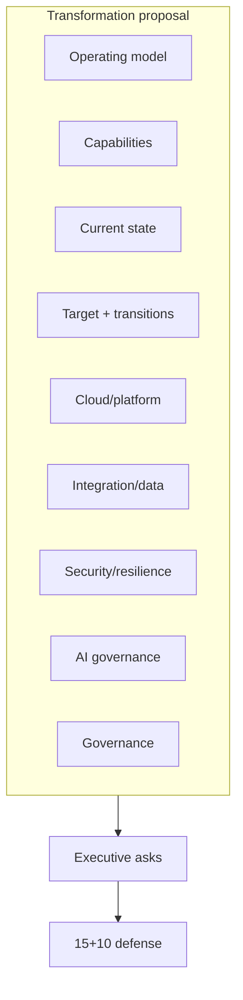

# Lab 10 — Student Instructions

**Module:** 10 — Capstone and Architecture Leadership  
**Case study:** NorthStar Financial Services (fictional)  
**Student role:** Lead Enterprise Architect

---

## 1. Lab title

NorthStar Enterprise Transformation Program — finalize and defend.

## 2. Business context

NorthStar’s executive committee has asked for an integrated transformation proposal covering operating model, capabilities, current/target state, platforms, integration, security/resilience, AI, governance, and a 24-month roadmap—with explicit decision asks.

## 3. Learning objectives

1. Integrate artifacts into a coherent executive narrative.  
2. Complete the 24-artifact package.  
3. Present and defend within 15+10 minutes and ≤15 slides.

## 4. Architecture diagram

## 5. Prerequisites

- Read `capstone/student-brief/capstone-brief.md` fully  
- Bring weekly artifacts from Modules 01–09  
- Draft presentation outline

## 6. Tasks

1. Run the completeness checklist for all 24 artifacts; remediate gaps.  
2. Write/refresh the executive decision memo that frames the program asks.  
3. Build the ≤15-slide presentation from the outline template.  
4. Rehearse to 15:00; prepare SAY defenses for top three challenges.  
5. Deliver to the review panel; capture follow-ups.  
6. Submit document package and slides to BayLearn.

## 7. Deliverables

| Deliverable | Format | Weight link |
| ----------- | ------ | ----------- |
| Capstone document (24 artifacts) | Structured pack / PDF | Capstone document 20% |
| Executive presentation | ≤15 slides | Final presentation 15% |
| Personal leadership plan | Template 15 | Module 10 assignment |

## 8. Validation steps

- [ ] Completeness checklist 24/24 or explicit remediation plan approved  
- [ ] Deck ≤15 slides  
- [ ] Timed rehearsal ≤16 minutes  
- [ ] Fiction notice present  
- [ ] Five ADRs included and consistent with recommendations  

## 9. Common failure scenarios

| Symptom | Cause | Recovery |
| ------- | ----- | -------- |
| Over time | Too many slides/detail | Cut to narrative spine |
| No asks | Artifact dump | Add decision slide |
| Contradictory ADRs | Drift across weeks | Reconcile before panel |

## 10. Troubleshooting

- Missing Module 3 inventory: use `capstone/datasets/README.md` pointer and prior CSV when available; document assumptions.  
- Incomplete AWS labs: architecture narrative may proceed with diagrams; note lab evidence gaps honestly.

## 11. Submission requirements

Upload to BayLearn `module-10` / capstone assignment per cohort instructions.

Naming: `M10_Capstone_<LastName>.zip` and `M10_Presentation_<LastName>.pdf`

## 12. Stretch objectives

See [`stretch-objectives.md`](stretch-objectives.md).

## 13. Templates

- `student/templates/25-executive-presentation-outline.md`  
- `student/templates/14-architecture-portfolio-checklist.md`  
- `student/templates/15-personal-leadership-plan.md`

## 14. Reference solution

Instructor-only: `instructor/reference-solutions/module-10/` and `capstone/reference-architecture/` (instructor-oriented).
