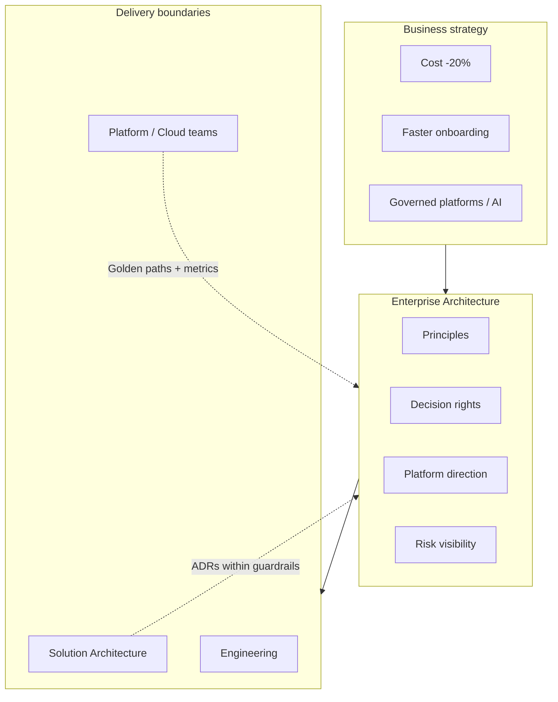

# Lesson 1.1 — What EA Really Is

**Module:** 01 — The Enterprise Architect’s Role  
**Duration:** ~20 minutes (live portion)  
**Learning objectives:** M01-LO1

---

## Opening hook (NorthStar)

The CIO’s staff meeting ends with a familiar complaint: *“We have architects everywhere—Payments has three, Partner Channels has two, Retail has a ‘chief architect’—and we still approved three overlapping customer-identity projects last quarter.”*

You have been hired as Lead Enterprise Architect. The room looks at you as if you will now personally redesign every system. That is **not** the job. Your first leadership act is to redefine what enterprise architecture is for at NorthStar—before you publish a single standard.

> **Fiction notice:** NorthStar Financial Services is fictional and instructional only.

---

## Learning outcomes for this lesson

By the end of this lesson, students can:

1. Define enterprise architecture in outcome language (strategy → capability → investment → technology direction).
2. Differentiate EA from solution, platform, cloud, and engineering leadership by **decision scope** and **time horizon**, not résumé keywords.

---

## Key concepts

### Enterprise architecture is a leadership system, not a drawing service

Enterprise architecture (EA) connects **business strategy** to **technology direction** across domains so that local decisions do not quietly create enterprise risk, cost, or fragmentation.

EA produces clarity on:

- What capabilities matter most
- Which platforms and patterns should be shared
- Where autonomy is safe
- Which risks require explicit executive trade-offs

EA does **not** mean:

- Designing every solution in detail
- Owning all delivery backlogs
- Being the final approver of every pull request
- Maintaining a giant Visio estate nobody uses

### Role boundaries that matter at NorthStar

| Role | Primary question | Typical horizon | Ownership signal |
| ---- | ---------------- | --------------- | ---------------- |
| Lead / Enterprise Architect | How should the enterprise decide and reuse technology direction? | 12–36 months | Cross-domain standards, portfolio risk, principles |
| Domain Architect | What is coherent inside a business/capability domain? | 6–24 months | Domain target state, pattern fit |
| Solution Architect (SA) | How do we deliver *this* outcome safely and fit standards? | Release / program | Solution design, ADRs for the initiative |
| Platform / Cloud Architect | What golden paths and guardrails enable teams? | Continuous | Landing zone, shared services, FinOps hooks |
| Engineering Manager | How do we deliver quality software with this team? | Sprint / quarter | Team capacity, engineering practices |

**Trade-off:** Overlapping titles are fine; overlapping **accountabilities** without decision rights create the NorthStar failure mode—architecture theater.

### Value EA creates (and how to measure it)

Executives fund EA when they see:

| Value theme | Leading indicator | Lagging indicator |
| ----------- | ----------------- | ----------------- |
| Cost & consolidation | Fewer duplicate platform proposals | Run-cost reduction on shared capabilities |
| Speed to market | Higher % of work on golden paths | Cycle time for common change types |
| Risk & resilience | Material risks on a visible register | Fewer late security/compliance surprises |
| Executive visibility | Decision memos and ADRs for big bets | Fewer “we didn’t know” ExCo moments |

If EA cannot name indicators, it will be judged on slide aesthetics.

---

## Framework / model

**EA decision stack (use this language with executives):**

```text
Strategy outcomes
    ↓
Capabilities & value streams (what we must be good at)
    ↓
Investment themes & constraints (budget, risk appetite, coexistence)
    ↓
Architecture principles & decision rights
    ↓
Platforms, patterns, standards, guardrails
    ↓
Solution choices inside those boundaries
```

When someone asks “Should we buy Product X?”, EA’s first move is to climb *up* the stack: which capability, which theme, which principle—not to start with vendor features.

---

## Enterprise example (NorthStar)

**Situation:** Partner Channels wants a new file-transfer product for onboarding partners. Payments already runs two file platforms. Retail’s onboarding team wants a third “modern” API-only approach.

**EA contribution (without owning delivery):**

1. Frame the capability: Partner Integration and Customer Onboarding (value streams), not “file transfer tech.”
2. Surface enterprise risk: inconsistent identity, duplicate ops cost, audit evidence fragmentation.
3. Force a decision class: this is a **cross-domain platform** decision, not a local solution choice.
4. Propose interim coexistence: one golden path + time-boxed exception for the acquired Payments stack.

**Non-EA trap:** Personally designing the partner API in a three-week spike while the operating model remains undefined.

---

## Trade-offs

| Framing of EA | Pros | Cons | When it fits |
| ------------- | ---- | ---- | ------------ |
| Strategy partner / portfolio steward | Executive relevance; outcome language | Can feel “too abstract” to engineers | Transformation programs; fragmented post-acquisition enterprises like NorthStar |
| Standards & governance office | Clear controls; audit friendliness | Becomes a gate; teams route around | High regulatory pressure *and* strong delivery alternatives (golden paths) |
| Embedded senior designers | High design quality on priority programs | Does not scale; creates hero dependency | Short-term rescue of a critical program—not Year-1 operating model |

There is no universal “best” framing. NorthStar’s Year-1 need is closer to **strategy partner + lightweight decision rights**, not a heavy standards bureaucracy.

---

## Common mistakes

- Equating EA with “more senior solution architect.”
- Publishing 40 principles before clarifying mission and decision rights.
- Claiming authority you do not have—then losing credibility when teams ignore you.
- Ignoring BU architects (they are your coalition, not your competition).

---

## Discussion prompts

1. If NorthStar killed the EA role tomorrow, which of the eight leadership intents would degrade first—and through what mechanism?
2. Where is the line between “helpful senior design” and “EA anti-pattern” on a high-visibility payments modernization?

---

## Diagram (Mermaid)



---

## Transition to next lesson / lab

Once the room agrees EA is a **decision and influence system**, the next question is structural: centralized, federated, or hybrid? Lesson 1.2 builds NorthStar’s operating model options with explicit trade-offs.

---

## References for instructors (non-proprietary)

- Course content standards and NorthStar baseline
- Role distinctions above (course glossary: EA, SA, guardrail, gate)
- Avoid presenting any single industry framework as mandatory; use frameworks as optional vocabulary, not dogma
