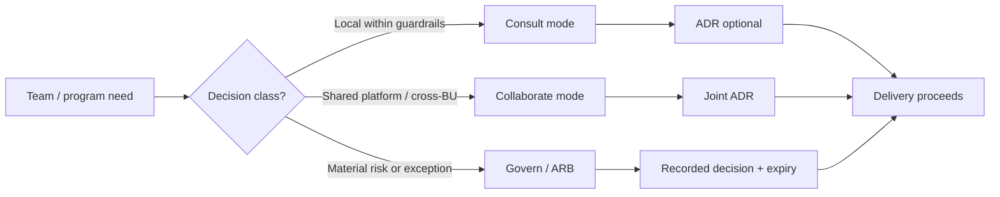

# Lesson 1.2 — Architecture Operating Model

**Module:** 01 — The Enterprise Architect’s Role  
**Duration:** ~25 minutes (live portion)  
**Learning objectives:** M01-LO2

---

## Opening hook (NorthStar)

NorthStar’s BU architects are competent and busy. Retail’s architect ships standards that Payments never adopted. Partner Channels escalates straight to the CTO for tool choices. Security is invited after contracts are signed.

The CIO asks you: *“Do we centralize architecture under you, leave it federated, or invent a hybrid?”*

Your answer cannot be “best practice.” It must be a **trade-off** that fits acquisition legacy, regulatory pressure, and delivery speed goals.

> **Fiction notice:** NorthStar Financial Services is fictional.

---

## Learning outcomes for this lesson

By the end of this lesson, students can:

1. Compare centralized, federated, and hybrid architecture operating models with consequences for NorthStar.
2. Specify decision rights, RACI, and an engagement model that clarifies when to consult, collaborate, or govern.

---

## Key concepts

### What an architecture operating model includes

An operating model is not an org chart alone. For this course it includes:

| Element | Purpose |
| ------- | ------- |
| Mission | Why the function exists in business language |
| Structure option | Central / federated / hybrid (and reporting lines) |
| Decision rights | Who decides what class of decision |
| RACI | Who is Responsible / Accountable / Consulted / Informed |
| Engagement model | How work enters architecture; SLAs; ARB triggers |
| Cadence | Forums, artifacts, metrics |
| Funding & capacity | How EA time is prioritized |

Without decision rights, RACI is theater. Without engagement design, architects become either bottlenecks or ignored advisors.

### Structural options (no dogma)

#### Option A — Centralized EA

Enterprise architects report to a single Lead EA / CIO office. BU “architects” become solution architects under delivery.

| Pros | Cons |
| ---- | ---- |
| Consistent standards; clear accountability | Slow; political resistance post-acquisition; knowledge distant from products |
| Easier executive reporting | Single point of overload; can starve delivery of design help |

**Fits when:** Extreme fragmentation *and* executive willingness to reset reporting lines quickly.

#### Option B — Federated EA

Architects stay in BUs. Enterprise EA is a small coordinating office (principles, portfolio risk, cross-domain decisions).

| Pros | Cons |
| ---- | ---- |
| Local speed and context; respects BU power | Inconsistent standards; “enterprise” becomes optional |
| Lower org-change cost | Hard to fund shared platforms; weak escalation |

**Fits when:** Strong BU P&L autonomy and weak appetite for reorg—**NorthStar’s starting reality**.

#### Option C — Hybrid (recommended starting posture for NorthStar Year 1)

BU architects remain federated for domain/solution work. A small enterprise architecture office owns principles, cross-domain decision rights, platform strategy partnership, and executive risk visibility. A lightweight Architecture Review Board (ARB) handles **material** exceptions—not every project.

| Pros | Cons |
| ---- | ---- |
| Coalition with BU architects; faster buy-in | Ambiguity if decision classes are vague |
| Balances autonomy and enterprise risk | Requires discipline on what escalates |

**Fits when:** Acquired estates, shared regulatory obligations, and transformation goals that need both local delivery and shared platforms—**NorthStar**.

### Engagement model: consult → collaborate → govern

| Mode | Trigger examples | EA behavior | Failure if misused |
| ---- | ---------------- | ----------- | ------------------ |
| Consult | Team wants a second opinion; low cross-domain impact | Advice, patterns, ADR coaching | Becomes rubber stamp or ignored |
| Collaborate | Shared platform change; multi-BU capability | Co-design; joint ADR | EA becomes unpaid project manager |
| Govern | Material risk, cost, multi-year lock-in, principle exception | Decision rights / ARB | Gatekeeping without golden paths → shadow IT |

**Principle:** Automate **guardrails** where possible; reserve human **gates** for high-impact decisions.

### Decision classes (minimum set for Lab 01)

1. **Local solution choices within guardrails** — SA + EM accountable; EA informed or consulted.
2. **Domain target-state / pattern selection** — Domain architect accountable; EA consulted; ARB if cross-domain conflict.
3. **Enterprise principles & standards** — Lead EA accountable; CIO approves; BUs consulted.
4. **Platform golden-path changes** — Platform architect accountable; EA + Security consulted; ARB for breaking changes.
5. **Material exceptions / high-risk AI / multi-year vendor lock-in** — ARB or ExCo technology committee accountable.

---

## Framework / model

**NorthStar hybrid operating model (conceptual):**

```text
CIO / CTO
 ├── Lead Enterprise Architect (enterprise mission, principles, portfolio risk)
 │     ├── Architecture Review Board (material decisions / exceptions)
 │     └── Shared services partnership (Platform, Security, Data)
 └── Business Units (Retail, Payments, Partners, Wealth)
       └── Domain / Solution Architects (federated)
             └── Delivery teams
```

See also [`../diagrams/operating-model.mmd`](../diagrams/operating-model.mmd).

---

## Enterprise example (NorthStar)

**Decision:** Payments proposes a second API gateway “only for high-volume payment APIs,” citing latency.

| Approach | Likely outcome |
| -------- | -------------- |
| Pure federate (“BU decides”) | Gateway sprawl; ops and security evidence diverge |
| Pure centralize (“EA blocks”) | Delivery delay; political bypass to CTO |
| Hybrid | Treat as platform decision class; time-boxed exception with metrics and sunset; ARB if exception exceeds threshold |

The hybrid answer is not “nicer”—it is **more honest** about power and risk.

---

## Trade-offs

| Design choice | Pros | Cons | When it fits |
| ------------- | ---- | ---- | ------------ |
| Broad ARB (most projects) | Visibility | Queue; theater; teams bypass | Rarely Year 1 at NorthStar |
| Narrow ARB (material only) + guardrails | Speed + risk focus | Requires clear thresholds | Default recommendation |
| EA reports into a single BU | Delivery intimacy | Captured by local P&L | Avoid for Lead EA |
| Dual-hat Lead EA + program architect | Short-term capacity | Conflicts of interest | Temporary only; declare it |

---

## Common mistakes

- Drawing an org chart and calling it an operating model.
- RACI with two Accountables for the same decision.
- Engagement SLAs that promise “48-hour review of everything”—then become the bottleneck.
- Ignoring Security/Data as first-class consulted roles on decision classes that affect controls and golden records.

---

## Discussion prompts

1. What is the *minimum* set of decisions that must be enterprise-accountable at NorthStar in Year 1?
2. If a BU president says “architecture slows us down,” which operating-model change would you make first—and what would you refuse to dilute?

---

## Diagram (Mermaid)



---

## Transition to next lesson / lab

An operating model without **principles** still forces case-by-case politics. Lesson 1.3 turns NorthStar strategy themes into 8–10 principles with exception paths.

---

## References for instructors (non-proprietary)

- NorthStar baseline: architects in BUs, no consistent governance
- Course glossary: guardrail vs. gate; ARB
- Emphasize trade-offs; do not crown hybrid as universal truth—defend it for *this* context
