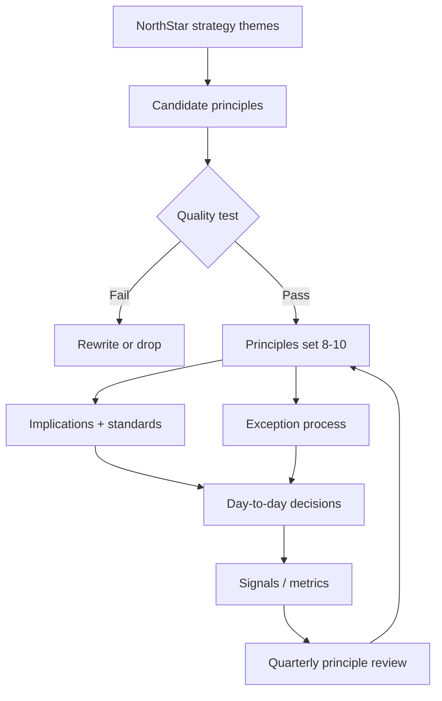

# Lesson 1.3 — Architecture Principles

**Module:** 01 — The Enterprise Architect’s Role  
**Duration:** ~20 minutes (live portion)  
**Learning objectives:** M01-LO3

---

## Opening hook (NorthStar)

A well-meaning architecture working group drafts 37 “principles,” including “Prefer Kubernetes,” “APIs first,” “Cloud native,” and “Be agile.” Engineering managers nod politely. Six months later, nothing changed—except the wiki page count.

Principles fail when they are **technology fashion statements** instead of **decision constraints** tied to strategy and exception discipline.

> **Fiction notice:** NorthStar Financial Services is fictional.

---

## Learning outcomes for this lesson

By the end of this lesson, students can:

1. Write principles with statement, rationale, implications, exception path, and success signals.
2. Connect principles to NorthStar strategy themes without turning them into a product shopping list.

---

## Key concepts

### What a principle is (and is not)

| A principle is… | A principle is not… |
| --------------- | ------------------- |
| An enduring rule that guides choices when options conflict | A project requirement |
| Traceable to business outcomes and risk appetite | A vendor preference dressed as strategy |
| Actionable via implications (“therefore teams must…”) | A slogan (“be customer-centric”) with no decision effect |
| Exceptionable via a known process | An absolute that invites underground workarounds |

### Anatomy of a usable principle

For each principle document:

1. **Name** — short, memorable  
2. **Statement** — “We will…”  
3. **Rationale** — “Because…” (link to NorthStar outcomes)  
4. **Implications** — “Therefore teams must / must not…”  
5. **Domain** — Business / Data / Application / Technology / Security / AI  
6. **Exceptions** — who requests, who decides, expiry  
7. **Signals** — how we know it is working  

Template: [`student/templates/03-architecture-principles.md`](../../../student/templates/03-architecture-principles.md)

### From NorthStar strategy to principle themes

| Leadership intent | Principle theme (examples) |
| ----------------- | -------------------------- |
| Reduce operating costs 20% | Reuse before rebuild; cost transparency by design |
| Faster customer onboarding | Prefer platform golden paths for onboarding capabilities |
| Faster digital products | Automate guardrails; minimize manual gates |
| Standardize cloud | Workload placement by fit; shared landing-zone standards |
| Resilience & compliance | Secure and resilient by design; evidence as a product |
| Consolidate integration | Integration patterns by coupling/latency—not team preference |
| Governed AI | Human accountability for high-risk AI decisions |
| Executive visibility | Explicit decisions (ADRs) for material bets |

Aim for **8–10** principles. Fewer than 6 usually under-constrain; more than 12 usually means you wrote standards, not principles.

### Exception management (non-negotiable)

Without exceptions, principles become lies. With uncontrolled exceptions, principles become wallpaper.

Minimum exception path:

```text
Request (context, principle touched, risk, sunset date)
  → Risk assessment (Security / EA / Data as needed)
  → Decision (named Accountable; recorded)
  → Expiry / review (calendar reminder; metrics)
```

Time-boxed exceptions beat permanent “special cases,” especially across acquired NorthStar lines of business.

---

## Framework / model

**Principle quality test (use in lab peer review):**

```text
1. Does it change a real decision this quarter?
2. Can a team violate it accidentally today?
3. Is the exception path clear enough to use under delivery pressure?
4. Is there a signal that is not vanity (wiki hits)?
5. Would an executive understand the rationale in one sentence?
```

If any answer is “no,” rewrite or drop the principle.

---

## Enterprise example (NorthStar)

### Weak principle

> “We will be API-first and cloud-native.”

Problems: undefined terms; conflicts with coexistence reality; no exception path; encourages slogan compliance.

### Stronger principle (illustrative)

> **P5 — Prefer platform golden paths**  
> **Statement:** We will deliver common workload classes through supported golden paths before creating new platforms.  
> **Rationale:** Duplicate platforms inflate cost, dilute security evidence, and slow onboarding—undermining NorthStar’s cost and speed intents.  
> **Implications:** Teams must justify new platforms against capability reuse; Platform owns path roadmaps; EA consulted on new path proposals.  
> **Exceptions:** ARB-approved time-boxed exceptions with sunset and migration owner.  
> **Signals:** % of new services on golden paths; count of active exception platforms; duplicate-platform run-cost trend.

---

## Trade-offs

| Principle style | Pros | Cons | When it fits |
| --------------- | ---- | ---- | ------------ |
| Business-outcome principles | Executive resonance | Engineers may call them vague | Always include a core set |
| Technology-directional principles | Clear for builders | Age quickly; invite dogma | Use sparingly; pair with expiry |
| Control-heavy principles | Audit comfort | Slow delivery; shadow IT | High-risk domains only; offset with golden paths |
| Few principles + strong standards library | Clarity of layers | Requires maintenance discipline | Preferred NorthStar Year-1 posture |

**Trade-off to teach:** Principles should be stable; **standards** and **golden paths** should evolve. Do not put “use Product X” in the principle set.

---

## Common mistakes

- Writing principles as a disguised technology roadmap.
- No metrics or only vanity metrics.
- Exception process that requires six signatures (teams will not use it).
- Principles that contradict each other without a stated precedence rule (e.g., “speed” vs. “reuse” with no guidance).

---

## Discussion prompts

1. Which NorthStar principle would most threaten a BU president’s local autonomy—and how would you socialize it without a pure power play?
2. Should “secure by design” be one principle or folded into every principle’s implications? Defend your choice with trade-offs.

---

## Diagram (Mermaid)



---

## Transition to next lesson / lab

Principles and operating models still fail if the Lead EA cannot **influence without authority**. Lesson 1.4 assesses leadership readiness and first-90-day moves.

---

## References for instructors (non-proprietary)

- Student template `03-architecture-principles.md`
- Content standards: trade-offs over “best practice” dogma
- Keep AI and security present even in early modules (proportionate)
