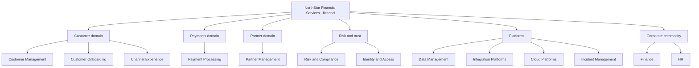

# Diagram — Level 1 Capability Map (illustrative)

**Module:** 02  
**Use:** Lesson 2.2 / lab facilitation

```mermaid
flowchart TB
  NS[NorthStar Financial Services - fictional]
  NS --> CU[Customer domain]
  NS --> PY[Payments domain]
  NS --> PR[Partner domain]
  NS --> RK[Risk and trust]
  NS --> PL[Platforms]
  NS --> CO[Corporate commodity]
  CU --> C01[Customer Management]
  CU --> C02[Customer Onboarding]
  CU --> C14[Channel Experience]
  PY --> C03[Payment Processing]
  PR --> C04[Partner Management]
  RK --> C06[Risk and Compliance]
  RK --> C07[Identity and Access]
  PL --> C08[Data Management]
  PL --> C09[Integration Platforms]
  PL --> C10[Cloud Platforms]
  PL --> C11[Incident Management]
  CO --> C12[Finance]
  CO --> C13[HR]
```
