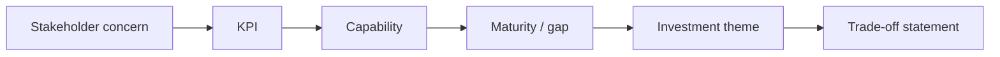

# Diagram — Outcome Traceability

**Module:** 02  
**Use:** Lesson 2.4

```mermaid
flowchart LR
  A[Stakeholder concern] --> B[KPI]
  B --> C[Capability]
  C --> D[Maturity / gap]
  D --> E[Investment theme]
  E --> F[Trade-off statement]
```
