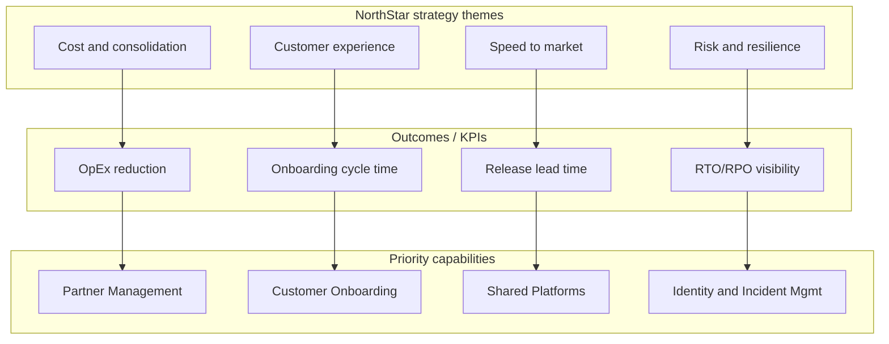

# Diagram — Strategy to Capability

**Module:** 02  
**Use:** Lesson 2.1 slides / whiteboard

```mermaid
flowchart TB
  subgraph Strategy["NorthStar strategy themes"]
    T1[Cost and consolidation]
    T2[Customer experience]
    T3[Speed to market]
    T4[Risk and resilience]
  end
  subgraph Outcomes["Outcomes / KPIs"]
    O1[OpEx reduction]
    O2[Onboarding cycle time]
    O3[Release lead time]
    O4[RTO/RPO visibility]
  end
  subgraph Caps["Priority capabilities"]
    C1[Partner Management]
    C2[Customer Onboarding]
    C3[Shared Platforms]
    C4[Identity and Incident Mgmt]
  end
  T1 --> O1 --> C1
  T2 --> O2 --> C2
  T3 --> O3 --> C3
  T4 --> O4 --> C4
```

> Fiction notice: NorthStar Financial Services is a fictional instructional case study.
