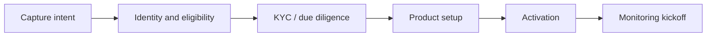

# Diagram — Customer Onboarding Value Stream

**Module:** 02  
**Use:** Lesson 2.3 / lab

**Capability overlay (many-to-many):** Channel Experience, Identity & Access, Risk & Compliance, Data Management, Product Management, Payment Processing, Customer Management.
