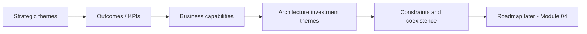

# Lesson 2.1 — Strategy to Architecture

**Module:** 02 — Business Architecture and Capability Mapping  
**Duration:** ~20 minutes (live portion)  
**Learning objectives:** MLO-2.1

---

## Opening hook (NorthStar)

The NorthStar Executive Committee wants a 20% operating-cost reduction, faster customer onboarding, and governed AI—while acquired lines of business still run duplicate platforms. The CIO asks you, the new Lead Enterprise Architect: “What’s our architecture priority list?” If you answer with a cloud migration list or a vendor shortlist, you skipped the strategy-to-architecture bridge.

---

## Learning outcomes for this lesson

By the end of this lesson, students can:

1. Convert strategic themes into architecture priorities, constraints, and open investment questions.
2. Separate strategy translation from solution selection—and know when each is appropriate.

---

## Key concepts

### Strategy themes vs. initiatives vs. architecture response

Strategy themes describe **outcomes leadership cares about**. Initiatives are **funded work packages**. Architecture response is the set of **principles, capabilities, platforms, and constraints** that make initiatives coherent.

At NorthStar, “reduce cost 20%” is a theme. “Decommission three partner file gateways” might be an initiative. “Consolidate integration platforms with clear ownership and golden paths” is an architecture response that may enable many initiatives.

### Architecture priorities and constraints

Priorities answer: *Where should scarce architecture attention go first?*  
Constraints answer: *What must remain true even if we move fast?* (regulation class of controls, coexistence of acquired systems, budget phasing, skills ramp).

### Investment questions (before answers)

Strong EAs force clarity with questions such as:

- Which capabilities create differentiation vs. merely keep the lights on?
- Where does duplication destroy value fastest?
- Which outcomes have measurable KPIs this year vs. multi-year bets?
- What must improve before AI or platform bets are credible?

---

## Framework / model

**Strategy → Outcomes → Capabilities → Architecture themes**

```text
Strategic themes
      │
      ▼
Business outcomes / KPIs
      │
      ▼
Business capabilities (what we must be good at)
      │
      ▼
Architecture investment themes + constraints
      │
      ▼
(Only then) target patterns, platforms, roadmaps
```

---

## Enterprise example (NorthStar)

| Strategic theme | Outcome / KPI | Capability focus | Architecture investment question |
| --------------- | ------------- | ---------------- | -------------------------------- |
| Cost & consolidation | OpEx −20% | Partner Integration, Integration Platform Mgmt | Where is duplicate run-cost concentrated? |
| Customer experience | Onboarding cycle time ↓ | Customer Onboarding, Customer Data Management | Which capability gaps cause rework and defects? |
| Speed to market | Release lead time ↓ | Product Delivery, Shared Platforms | What is commodity vs. differentiating to build? |
| Risk & resilience | Measurable RTO/RPO | Incident Response, Identity & Access | Where is risk invisible to executives today? |

---

## Trade-offs

| Option | Pros | Cons | When it fits |
| ------ | ---- | ---- | ------------ |
| Theme-first architecture agenda | Aligns exec attention; resists pet projects | Feels slow to teams craving “the answer” | Early transformation; fragmented estate |
| Initiative-first architecture support | Fast local help; visible delivery | Reinforces silos; weak enterprise coherence | Stabilization firefighting only |
| Hybrid: themes + 2–3 lighthouse initiatives | Balances narrative and proof | Requires discipline to avoid scope creep | Most realistic for NorthStar Year 1 |

---

## Common mistakes

- Jumping from “cost down 20%” to “move everything to cloud” without capability analysis.
- Treating every LOB wish as a strategic theme.
- Publishing priorities without constraints (teams assume unconstrained greenfield).

---

## Discussion prompts

1. Which NorthStar theme should dominate Year 1 architecture attention—and what evidence would change your mind?
2. How do you push back when a BU president asks for an architecture “priority” that is really a project preference?

---

## Diagram (Mermaid)



---

## Transition to next lesson / lab

With themes and questions framed, Lesson 2.2 builds the capability map—the durable structure that survives org changes and system churn.

---

## References for instructors (non-proprietary)

- Business capability modeling practices (industry-standard BA concepts)
- Course content standards and NorthStar baseline
