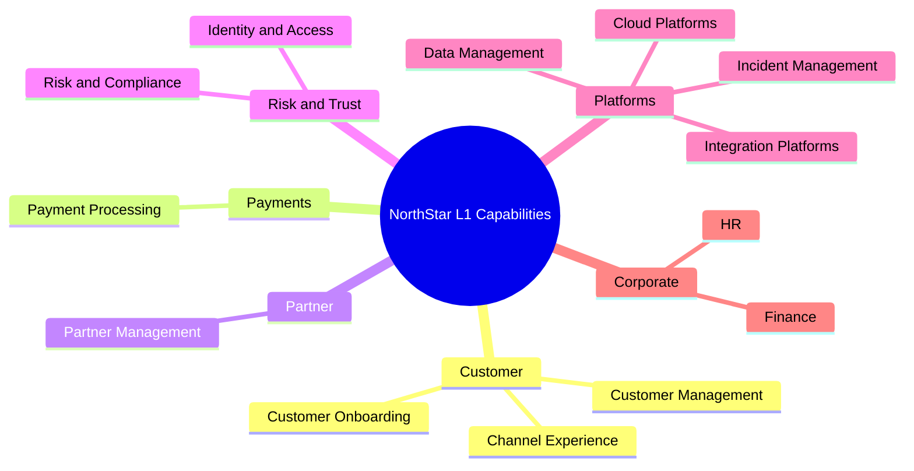

# Lesson 2.2 — Capability Mapping

**Module:** 02 — Business Architecture and Capability Mapping  
**Duration:** ~25 minutes (live portion)  
**Learning objectives:** MLO-2.2

---

## Opening hook (NorthStar)

NorthStar has 300+ applications and multiple acquired companies. Ask five directors “Who owns payments?” and you may get five org-chart answers. Ask “What capabilities does payments require?” and you start a map that can survive reorganizations. Capability maps are how EAs stop arguing about systems long enough to decide what the enterprise must be good at.

---

## Learning outcomes for this lesson

By the end of this lesson, students can:

1. Define Level 1–2 capabilities that are org- and system-independent.
2. Classify capabilities as Core, Supporting, or Commodity and assign plausible ownership.

---

## Key concepts

### Capability definition

A **business capability** is what the enterprise does to create value—stable over time, independent of who does it today and which systems automate it.

| Not a capability | Why |
| ---------------- | --- |
| “Salesforce team” | Org unit |
| “Payments mainframe” | Application |
| “Cloud migration” | Project / initiative |
| “Process payments” / “Customer onboarding” | Capability (good) |

### Levels

- **Level 1:** Enterprise-wide nouns/verbs of value (8–15 typical for a map executives can grasp).
- **Level 2:** Decompositions that support investment and ownership conversations.
- **Level 3:** Optional detail for deep domain work; avoid boiling the ocean in Week 2.

### Capability types

| Type | Meaning | Architecture implication |
| ---- | ------- | ------------------------ |
| Core | Differentiates or is central to NorthStar’s value | Invest for advantage; careful build/buy |
| Supporting | Necessary for operating the business | Fit-for-purpose; often shared platforms |
| Commodity | Expected hygiene; little differentiation | Prefer buy/standardize; minimize custom |

### Maturity (preview for heatmap)

Score process, data, technology, and people separately when evidence exists. A high-tech score with poor data maturity is a common NorthStar pattern (especially post-acquisition).

---

## Framework / model

**Capability map construction loop**

```text
1. Draft L1 from strategy + value domains (customer, payments, partner, risk, corporate, platforms)
2. Stress-test: org-independent? system-independent? stable wording?
3. Classify Core / Supporting / Commodity
4. Assign primary owner (accountable executive or capability owner role)
5. Expand priority L1s to L2
6. Capture maturity evidence → heatmap (Lesson 2.4 / lab)
```

---

## Enterprise example (NorthStar)

Suggested Level 1 starter set (students may refine):

| L1 ID | Capability | Type | Primary owner (illustrative) |
| ----- | ---------- | ---- | ---------------------------- |
| C01 | Customer Management | Core | Chief Customer Officer |
| C02 | Customer Onboarding | Core | Retail Banking President |
| C03 | Payment Processing | Core | Payments LOB President |
| C04 | Partner Management | Core | Partnerships EVP |
| C05 | Product Management | Core | Chief Product Officer |
| C06 | Risk & Compliance Management | Supporting | CRO / CISO (shared) |
| C07 | Identity & Access Management | Supporting | CISO |
| C08 | Data Management | Supporting | Chief Data Officer |
| C09 | Integration Platform Management | Supporting | CTO / Platform |
| C10 | Cloud & Infrastructure Platforms | Supporting | CTO / Cloud Center |
| C11 | Incident & Service Management | Supporting | CIO / SRE leadership |
| C12 | Finance & Controllership | Commodity | CFO |
| C13 | HR & Workforce Management | Commodity | CHRO |
| C14 | Channel Experience Delivery | Core | Digital Experience lead |

Level 2 example for **Payment Processing**: Authorization, Clearing & Settlement, Fraud Detection Support, Payment Product Configuration, Reconciliation.

---

## Trade-offs

| Option | Pros | Cons | When it fits |
| ------ | ---- | ---- | ------------ |
| Broad L1 map (12–15) | Executive coverage; less rework later | Harder workshop facilitation | Multi-LOB enterprises like NorthStar |
| Narrow L1 map (6–8) | Fast consensus | Hides important domains | Pilot domains only |
| Deep L3 everywhere | Feels complete | Analysis paralysis; map dies | Avoid in Module 02 |

---

## Common mistakes

- Naming capabilities after current applications (“CoreBankingCapability”).
- Making every capability “Core” to avoid political fights.
- Assigning ownership to “IT” or “Architecture” for business capabilities.

---

## Discussion prompts

1. Is “Fraud Detection” a capability, a subprocess of Payments, or a Risk capability? How would you decide?
2. Who should own “Customer Data Management” when Retail and Cards both claim customers?

---

## Diagram (Mermaid)



---

## Transition to next lesson / lab

Capabilities describe *what*; value streams describe *how value flows end-to-end*. Lesson 2.3 connects them.

---

## References for instructors (non-proprietary)

- Business Architecture Guild / industry capability map practices (non-proprietary concepts)
- Course content standards and NorthStar baseline
