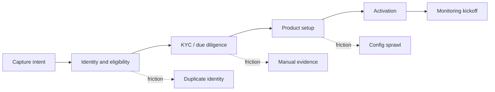

# Lesson 2.3 — Value Streams

**Module:** 02 — Business Architecture and Capability Mapping  
**Duration:** ~20 minutes (live portion)  
**Learning objectives:** MLO-2.3

---

## Opening hook (NorthStar)

Customer onboarding at NorthStar takes too long. Product teams blame KYC vendors; operations blame data quality; technology blames “legacy.” A value-stream map forces a shared picture: stages from prospect to activated customer, which capabilities are invoked, and where friction (hand-offs, rework, waits) destroys cycle time. Architecture investments then target friction—not the loudest complaint.

---

## Learning outcomes for this lesson

By the end of this lesson, students can:

1. Decompose a named NorthStar value stream into stages with triggering events and outcomes.
2. Overlay capabilities onto stages and identify architecture-relevant friction points.

---

## Key concepts

### Value stream vs. process vs. journey

| Concept | Focus |
| ------- | ----- |
| Value stream | End-to-end value creation for a stakeholder (enterprise lens) |
| Process | How work is performed (often departmentally detailed) |
| Customer journey | Experience touchpoints (outside-in); complements value streams |

EAs use value streams to connect capabilities and investments to outcomes without drowning in BPMN.

### NorthStar named value streams

1. Customer onboarding  
2. Payment processing  
3. Partner integration  
4. Incident response  
5. Product delivery  

Module 02 lab requires deep work on **at least one** (Customer Onboarding recommended); stretch adds a second.

### Friction taxonomy (architecture-relevant)

- **Data friction:** no golden record; conflicting customer IDs across acquisitions  
- **Integration friction:** file drops, point-to-point links, manual partner setup  
- **Control friction:** late security/compliance engagement; repeated evidence gathering  
- **Ownership friction:** unclear RACI across LOBs  
- **Platform friction:** no golden path; every team reinvents onboarding tooling  

---

## Framework / model

**Value stream → capability overlay**

```text
Trigger → Stage 1 → Stage 2 → … → Stage N → Outcome / KPI
              │         │              │
              └──── capabilities invoked (many-to-many) ────┘
              │
              └── friction notes → investment themes
```

---

## Enterprise example (NorthStar)

**Customer Onboarding (simplified stages)**

| Stage | Outcome of stage | Capabilities invoked | Typical friction |
| ----- | ---------------- | -------------------- | ---------------- |
| Capture intent | Application started | Channel Experience, Product Management | Channel inconsistency across brands |
| Identity & eligibility | Customer identity asserted | Identity & Access, Risk & Compliance | Duplicate identity stores |
| KYC / due diligence | Risk decision recorded | Risk & Compliance, Data Management | Manual evidence; slow partners |
| Product setup | Accounts/products ready | Product Management, Payment Processing | Product config sprawl |
| Activation & welcome | Customer can transact | Customer Management, Channel Experience | Broken hand-offs; data defects |
| Ongoing monitoring kickoff | Monitoring controls live | Risk & Compliance, Incident Mgmt | Controls bolted on late |

KPI examples: median time-to-activate; first-week defect rate; % straight-through processing.

---

## Trade-offs

| Option | Pros | Cons | When it fits |
| ------ | ---- | ---- | ------------ |
| One deep value stream | Actionable; fits lab timebox | Incomplete enterprise view | Module 02 default |
| Many shallow streams | Broad coverage | Weak investment signal | Executive overview only |
| Journey-first then capabilities | Strong CX narrative | May miss internal control stages | CX-led transformations |

---

## Common mistakes

- Drawing a system sequence diagram and calling it a value stream.
- Listing every subprocess equally instead of highlighting friction that blocks strategy.
- Mapping only happy-path stages and ignoring risk/compliance stages (fatal in financial services).

---

## Discussion prompts

1. Where should architecture invest first in Customer Onboarding: identity, data, or partner KYC integrations—and why?
2. How does Partner Integration value stream friction show up as cost in the Payments value stream?

---

## Diagram (Mermaid)



---

## Transition to next lesson / lab

Lesson 2.4 turns capability and value-stream insight into stakeholder-aware outcome mapping and heatmaps executives can debate.

---

## References for instructors (non-proprietary)

- Value stream mapping concepts adapted for architecture (not manufacturing shop-floor detail)
- Course content standards and NorthStar baseline
