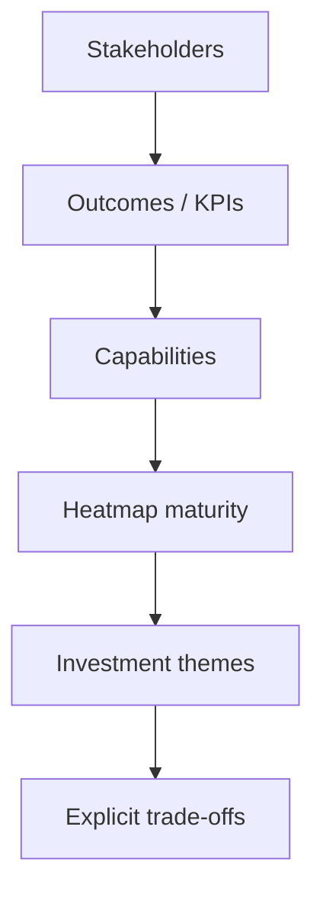

# Lesson 2.4 — Stakeholder and Outcome Mapping

**Module:** 02 — Business Architecture and Capability Mapping  
**Duration:** ~20 minutes (live portion)  
**Learning objectives:** MLO-2.4

---

## Opening hook (NorthStar)

You present a beautiful capability heatmap. The Retail Banking President sees red on onboarding and demands budget. The Cards LOB President sees amber on payments and wants a different vendor. The CISO sees green on “Identity” and knows the score is wrong. Heatmaps without stakeholder/outcome traceability become political Rorschach tests. Your job is to make the map a **decision instrument**.

---

## Learning outcomes for this lesson

By the end of this lesson, students can:

1. Link stakeholders, KPIs, and capability gaps into a coherent investment narrative.
2. Defend heatmap colors with evidence and explicit assumptions—not aesthetics.

---

## Key concepts

### Outcome traceability

```text
Stakeholder concern → KPI → Capability → Gap/maturity → Investment theme → (later) initiatives
```

If you cannot walk that chain, you are not ready for an executive conversation.

### Stakeholder archetypes (NorthStar)

| Stakeholder | Primary concerns | What they need from your map |
| ----------- | ---------------- | ---------------------------- |
| CEO / ExCo | Cost, growth, risk visibility | Few themes; clear bets |
| CIO / CTO | Platforms, debt, speed | Where shared platforms pay off |
| CISO / Risk | Controls, evidence | Risk-bearing capabilities called out |
| BU presidents | Autonomy, product speed | Local impact without denying enterprise constraints |
| Data leaders | Golden record, quality | Data capabilities not buried under apps |
| Platform / SRE | Golden paths, reliability | Supporting capabilities that need investment |

### Heatmap as leadership tool

Colors encode **relative** maturity or strategic health. Rules:

- Define the legend before coloring.
- Separate “strategic importance” from “current maturity” when possible (two views beat one muddy view).
- Document evidence and confidence (High/Med/Low).
- Prefer fewer, sharper investment recommendations over painting the whole map red.

---

## Framework / model

**Outcome mapping canvas (lab)**

```text
1. Pick strategic theme (e.g., Customer experience)
2. Name 1–2 KPIs and current/target
3. Identify capabilities on the critical path (from value stream)
4. Score maturity with evidence
5. Name the gap and architecture response theme
6. Note stakeholders who must agree / who will resist
7. State the trade-off you are recommending
```

---

## Enterprise example (NorthStar)

| Stakeholder | KPI | Capability | Maturity signal | Investment theme |
| ----------- | --- | ---------- | --------------- | ---------------- |
| Retail President | Time-to-activate | Customer Onboarding | High rework; manual KYC | Straight-through onboarding platformization |
| CDO | % golden customer ID | Data Management | Conflicting IDs post-acquisition | Customer master data capability uplift |
| CISO | Privileged access coverage | Identity & Access | Inconsistent federation | Identity as shared enterprise capability |
| CTO | Duplicate integration run-cost | Integration Platform Mgmt | Multiple file gateways | Consolidate integration platforms |

Trade-off example: Invest in customer master data before adding another onboarding channel—speed of new channels without data integrity increases defect cost.

---

## Trade-offs

| Option | Pros | Cons | When it fits |
| ------ | ---- | ---- | ------------ |
| Single combined heatmap | Simple slide | Mixes importance and health | Early alignment workshop |
| Dual view: importance × maturity | Clearer investment logic | Slightly more complex | Executive decisions |
| Bottom-up scoring only | Feels “data driven” | Politics of who scores | Needs facilitation rules |

---

## Common mistakes

- Coloring by how much people dislike a system (application bias).
- No confidence rating—treating rumors as maturity scores.
- Recommending ten “Priority 1” investments (none are priority).

---

## Discussion prompts

1. How do you handle a BU president who insists a commodity capability is “core” for their P&L narrative?
2. What is the minimum evidence you need before marking Identity maturity as red in a regulated environment?

---

## Diagram (Mermaid)



---

## Transition to next lesson / lab

Lab 02: build the capability map, overlay Customer Onboarding value stream, and produce a heatmap narrative suitable for an ExCo pre-read.

---

## References for instructors (non-proprietary)

- Stakeholder analysis and outcome mapping practices for EA
- Course content standards and NorthStar baseline
