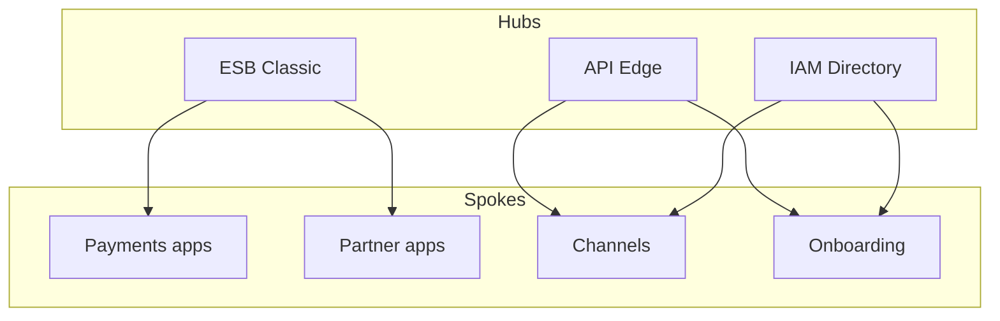

# Diagram — NorthStar Dependency Hubs (illustrative)

```mermaid
flowchart TB
  subgraph Hubs
    ESB[ESB Classic]
    API[API Edge]
    ID[IAM Directory]
  end
  subgraph Spokes
    PMT[Payments apps]
    PRT[Partner apps]
    CH[Channels]
    ON[Onboarding]
  end
  ESB --> PMT
  ESB --> PRT
  API --> CH
  API --> ON
  ID --> CH
  ID --> ON
```
