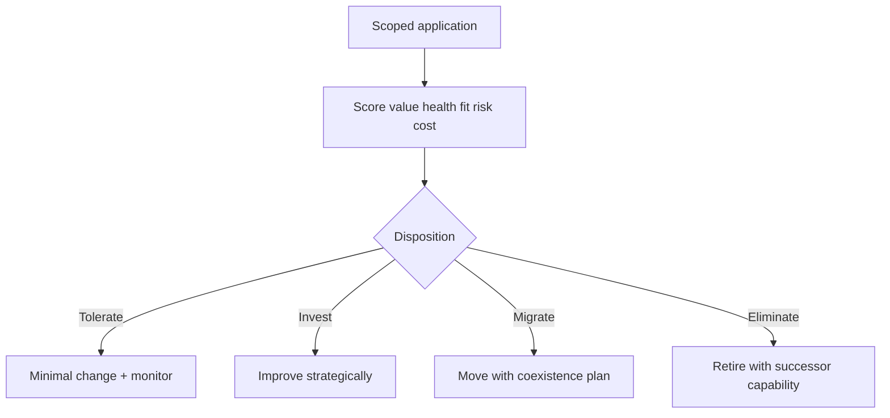

# Diagram — TIME Decision Flow

```mermaid
flowchart TB
  A[Scoped application] --> B[Score value health fit risk cost]
  B --> C{Disposition}
  C -->|Tolerate| T[Minimal change + monitor]
  C -->|Invest| I[Improve strategically]
  C -->|Migrate| M[Move with coexistence plan]
  C -->|Eliminate| E[Retire with successor capability]
```
