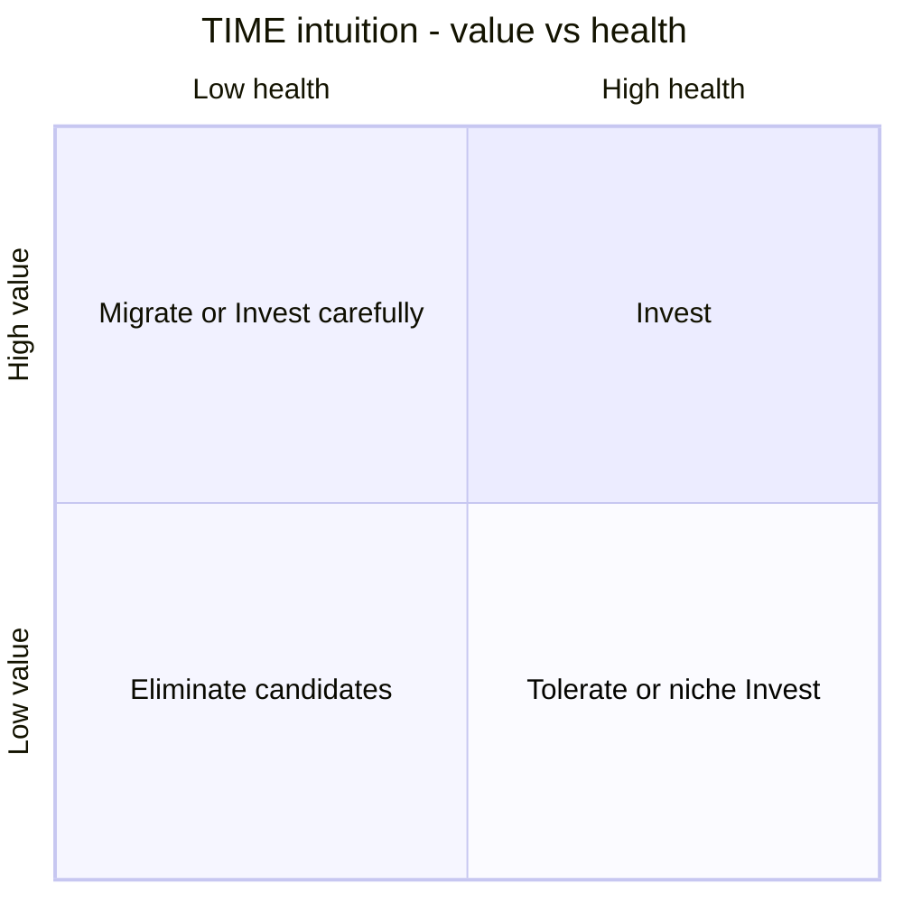

# Lesson 3.2 — APM / TIME

**Module:** 03 — Current-State Architecture Assessment  
**Duration:** ~25 minutes (live portion)  
**Learning objectives:** MLO-3.2

---

## Opening hook (NorthStar)

Two partner file gateways (Gateway A and Gateway B) both show high cost, poor technical health, and high security risk in the fictional inventory. A Cards architect says “Tolerate—our partners depend on it.” A platform engineer says “Eliminate this quarter.” TIME forces structured debate: Tolerate, Invest, Migrate, or Eliminate—with dimensions and consequences.

---

## Learning outcomes for this lesson

By the end of this lesson, students can:

1. Explain TIME categories and when each is appropriate.
2. Score applications across value, health, fit, risk, and cost—and defend a disposition.

---

## Key concepts

### TIME definitions

| TIME | Meaning | Typical signals |
| ---- | ------- | --------------- |
| **Tolerate** | Keep running with minimal change; accept limitations | Adequate value, low strategic change need, manageable risk |
| **Invest** | Improve / extend strategically | High value, strategic fit, health worth improving |
| **Migrate** | Move to a new platform/pattern while preserving capability | Value remains; tech/risk unacceptable long-term |
| **Eliminate** | Retire; capability absorbed elsewhere or no longer needed | Duplicate, low value, high cost/risk, EOL |

### Scoring dimensions (course default)

Business value · Technical health · Strategic fit · Risk · Cost efficiency (1–5). Disposition emerges from patterns—not a secret formula. Document rationale.

### Seed dispositions vs. analysis

The CSV column **Recommended disposition** is a **seed** for teaching. Strong students challenge it (e.g., MDM Attempt v1 seeded Eliminate; Customer360 may be Invest despite fair health because of strategic fit).

---

## Framework / model

```text
For each in-scope app:
  Score dimensions → Propose TIME → Check capability duplicates →
  Note dependencies → State residual risk if deferred → Record assumption
```

---

## Enterprise example (NorthStar)

| App | Pattern | TIME leaning | Why |
| --- | ------- | ------------ | --- |
| Partner File Gateway A/B | Duplicate, poor health, high cost | Eliminate (with migration path) | Consolidation theme |
| Pulse Authorization Gateway | Good health, mission critical | Invest | Strategic path |
| NorthStar Core Banking Suite | Mission critical, poor health | Migrate (long wave) | Cannot Eliminate abruptly |
| Release Calendar Spreadsheet Hub | Low criticality, poor practice | Eliminate | Replace with governed tooling |
| ERP Finance Core | Good health, mission critical commodity | Tolerate | Not Year-1 differentiation bet |

---

## Trade-offs

| Option | Pros | Cons | When it fits |
| ------ | ---- | ---- | ------------ |
| Strict numeric TIME thresholds | Consistency | False precision | Large portfolios with governance |
| Judgment-led TIME with dimensions | Nuance | Harder calibration | Leadership cohorts (this course) |
| Capability-first then apps | Aligns to Module 02 | Needs capability map | Required here |

---

## Common mistakes

- Eliminate without a capability landing zone (business continuity failure).
- Invest in every poor-health system (dilutes capital).
- Migrate as euphemism for “we don’t know.”

---

## Discussion prompts

1. When is Tolerate the bravest recommendation?
2. How do you TIME-score two apps that share a capability but differ in LOB politics?

---

## Diagram (Mermaid)



---

## Transition to next lesson / lab

TIME without dependencies creates impossible retirement plans. Lesson 3.3 maps coupling and concentration risk.

---

## References for instructors (non-proprietary)

- Gartner TIME model concepts as commonly taught in APM (non-proprietary teaching framing)
- Course templates 07-time-assessment
