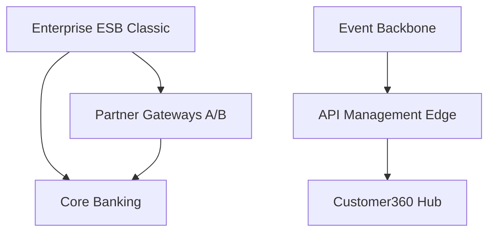

# Lesson 3.3 — Dependency Mapping

**Module:** 03 — Current-State Architecture Assessment  
**Duration:** ~20 minutes (live portion)  
**Learning objectives:** MLO-3.3

---

## Opening hook (NorthStar)

The inventory shows Enterprise ESB Classic with 62 integrations and API Management Edge with 55. Retiring the ESB “because TIME says Migrate” without a dependency wave plan will break partner onboarding and payments reconciliation on the same weekend. Dependencies turn TIME from labels into sequenced architecture.

---

## Learning outcomes for this lesson

By the end of this lesson, students can:

1. Identify dependency hubs and duplicate platform clusters from portfolio signals.
2. Explain how dependencies constrain Eliminate/Migrate sequencing.

---

## Key concepts

### Dependency types

| Type | Example at NorthStar | Risk |
| ---- | -------------------- | ---- |
| Runtime sync | Auth gateway → core banking | Immediate outage |
| Batch/file | Partner gateways → settlements | Delayed but severe |
| Data identity | Dual customer masters → channels | Silent defect propagation |
| Shared platform | ESB as hub | Concentrated change risk |
| Organizational | Same owner for conflicting apps | Change inertia |

### Concentration risk

Too much critical traffic through one fragile hub (ESB, single file gateway, single identity store) creates systemic exposure. Architecture response may be Invest in a target hub *and* Migrate spokes deliberately.

### Mapping depth for Module 03

Students are not expected to produce a full enterprise graph. Minimum bar:

- Hub list (high integration count + criticality)
- Duplicate clusters (two gateways, two customer masters, dual fraud tools)
- One sequencing implication for a Migrate/Eliminate candidate

---

## Framework / model

```text
App → Integration count + criticality → Hub?
   → Same capability peers → Duplicate cluster?
   → Data classification → Blast radius
   → TIME → Wave constraint note
```

---

## Enterprise example (NorthStar)

**Duplicate cluster — Customer masters:** Cards Customer Master + Retail Customer Master + Customer360 Hub.  
Implication: Eliminate/Migrate masters only with identity/data capability uplift (Module 02 theme); Customer360 may be Invest as target.

**Hub — Enterprise ESB Classic:** High integrations, poor health → Migrate to API + Event Backbone; spokes move in waves.

**Duplicate — Partner File Gateway A/B:** Eliminate one path after Partner Portal / API onboarding capability ready.

---

## Trade-offs

| Option | Pros | Cons | When it fits |
| ------ | ---- | ---- | ------------ |
| Hub-first modernization | Systemic leverage | Large coordination | Platform consolidation |
| Spoke-first fixes | Local wins | Hub remains fragile | Short-term risk buy-down |
| Parallel run (coexistence) | Safer cutover | Cost dual-run | Regulated NorthStar reality |

---

## Common mistakes

- Counting integrations without knowing criticality of each link.
- Assuming SaaS means “no dependencies.”
- Planning Eliminate dates before identifying the capability successor.

---

## Discussion prompts

1. Would you migrate ESB spokes before or after investing in Event Backbone—and why?
2. How do dual customer masters create dependency risk even if integration counts look moderate?

---

## Diagram (Mermaid)



---

## Transition to next lesson / lab

Lesson 3.4 converts portfolio and dependency insight into ranked risk and technical-debt narratives.

---

## References for instructors (non-proprietary)

- Dependency analysis / concentration risk concepts for EA
- Course content standards and NorthStar baseline
