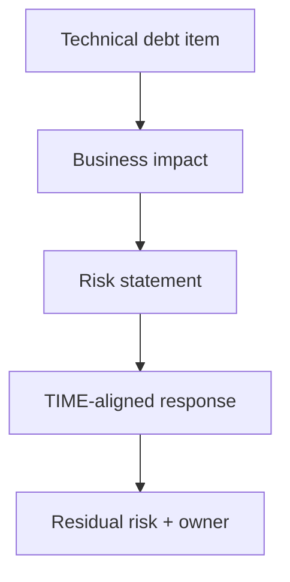

# Lesson 3.4 — Risk and Technical Debt

**Module:** 03 — Current-State Architecture Assessment  
**Duration:** ~20 minutes (live portion)  
**Learning objectives:** MLO-3.4

---

## Opening hook (NorthStar)

Technical debt is not “old code.” At NorthStar it is unpaid interest: duplicate customer masters creating KYC defects, dual file gateways raising partner incident rates, EOL dates landing inside audit season, shadow SaaS holding confidential data. Executives fund debt reduction when you price the interest in business language—risk, cost, speed—not shame about legacy.

---

## Learning outcomes for this lesson

By the end of this lesson, students can:

1. Distinguish technical debt types and express them as business-impacting risks.
2. Produce a ranked top-10 risk / debt view with responses tied to TIME and capabilities.

---

## Key concepts

### Debt categories (useful taxonomy)

| Category | NorthStar example |
| -------- | ----------------- |
| Deliberate tactical | Spreadsheet release hub to move fast |
| Accidental / entropy | ESB growth without ownership |
| Structural / acquisition | Dual customer masters, dual gateways |
| Compliance / evidence | Late control engagement; fragmented GRC evidence |
| Skills / operability | COBOL + scarce skills on core banking |

### Risk narrative structure

```text
Risk statement → Business impact → Evidence → Likelihood/exposure → Related apps/capabilities → Response (TIME-aligned) → Owner → Residual risk
```

### Top-10 discipline

Ten is a leadership device. If everything is top-10, you have a backlog dump. Merge related items; separate systemic risks from local bugs.

---

## Framework / model

**Risk × Debt prioritization**

```text
Score ≈ Business impact × Exposure × Urgency (EOL/audit/customer harm)
Then check: Is there a TIME move that reduces it? Is dependency sequencing a blocker?
```

---

## Enterprise example (NorthStar) — illustrative top risks

1. Dual customer masters → onboarding defects / regulatory exposure  
2. Dual partner file gateways → cost + security surface  
3. ESB concentration → change and outage blast radius  
4. Core banking poor health + skills → long Migrate wave needed  
5. Legacy web banking EOL → channel risk  
6. Shadow SaaS marketing suite → data leakage  
7. MDM Attempt v1 failure → wasted spend; blocks golden record  
8. Inconsistent customer IAM vs workforce IAM patterns → identity gaps  
9. FraudSentinel batch EOL overlapping FraudGuard realtime → unclear target path  
10. Observability gap on legacy NOC vs modern stack → incident response friction  

---

## Trade-offs

| Option | Pros | Cons | When it fits |
| ------ | ---- | ---- | ------------ |
| Risk-first funding | Exec alignment | May underfund platforms | Crisis / audit windows |
| Platform-first funding | Systemic leverage | Slower visible CX wins | Consolidation themes |
| Balanced portfolio | Dual narrative | Requires strong EA facilitation | NorthStar Year 1 |

---

## Common mistakes

- Listing CVEs without business impact.
- Ignoring debt that is “someone else’s LOB.”
- Proposing Eliminate without residual risk controls during coexistence.

---

## Discussion prompts

1. How do you convince a BU president to fund retirement of *their* gateway for enterprise benefit?
2. Which debt should remain Tolerate for a year—and how do you monitor it?

---

## Diagram (Mermaid)



---

## Transition to next lesson / lab

Lab 03: assess the fictional portfolio with TIME, dependency notes, and a top-10 risk register that Module 04 can sequence.

---

## References for instructors (non-proprietary)

- Technical debt as interest metaphor (industry-standard teaching)
- Course template 08-technical-debt-register
