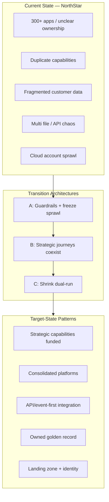

# Diagram 01 — Current to Target Journey

**Module:** 04  
**Use:** Lesson 4.1 / slides

```mermaid
flowchart TB
  subgraph current [Current State — NorthStar]
    C1[300+ apps / unclear ownership]
    C2[Duplicate capabilities]
    C3[Fragmented customer data]
    C4[Multi file / API chaos]
    C5[Cloud account sprawl]
  end
  subgraph transitions [Transition Architectures]
    T1[A: Guardrails + freeze sprawl]
    T2[B: Strategic journeys coexist]
    T3[C: Shrink dual-run]
  end
  subgraph target [Target-State Patterns]
    X1[Strategic capabilities funded]
    X2[Consolidated platforms]
    X3[API/event-first integration]
    X4[Owned golden record]
    X5[Landing zone + identity]
  end
  current --> T1 --> T2 --> T3 --> target
```

> NorthStar Financial Services is fictional.
