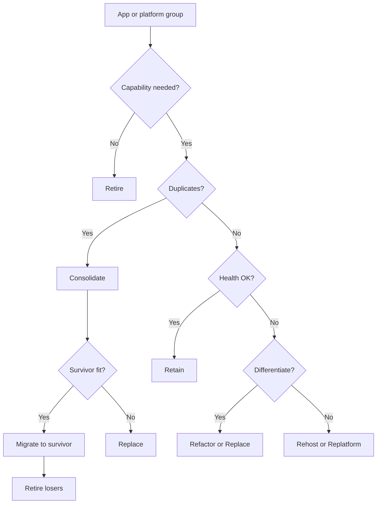

# Diagram 02 — Modernization Strategy Selection

**Module:** 04  
**Use:** Lesson 4.2 / slides

```mermaid
flowchart TD
  A[App or platform group] --> B{Capability needed?}
  B -->|No| Retire[Retire]
  B -->|Yes| C{Duplicates?}
  C -->|Yes| Consol[Consolidate]
  Consol --> D{Survivor fit?}
  D -->|Yes| Mig[Migrate to survivor]
  D -->|No| Replace[Replace]
  Mig --> Retire2[Retire losers]
  C -->|No| E{Health OK?}
  E -->|Yes| Retain[Retain]
  E -->|No| F{Differentiate?}
  F -->|Yes| RF[Refactor or Replace]
  F -->|No| RH[Rehost or Replatform]
```

> Strategies are execution choices; TIME remains the portfolio lens.
