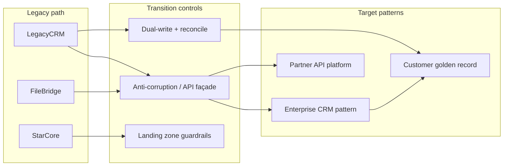

# Diagram 03 — Transition Coexistence

**Module:** 04  
**Use:** Lesson 4.3 / lab

```mermaid
flowchart LR
  subgraph legacy [Legacy path]
    LCRM[LegacyCRM]
    FB[FileBridge]
    SC[StarCore]
  end
  subgraph interim [Transition controls]
    ACL[Anti-corruption / API façade]
    DW[Dual-write + reconcile]
    LZ[Landing zone guardrails]
  end
  subgraph future [Target patterns]
    NCRM[Enterprise CRM pattern]
    API[Partner API platform]
    GR[Customer golden record]
  end
  LCRM --> ACL --> NCRM
  LCRM --> DW --> GR
  FB --> ACL --> API
  SC --> LZ
  NCRM --> GR
```

> Temporary bridges require dated exit criteria.
