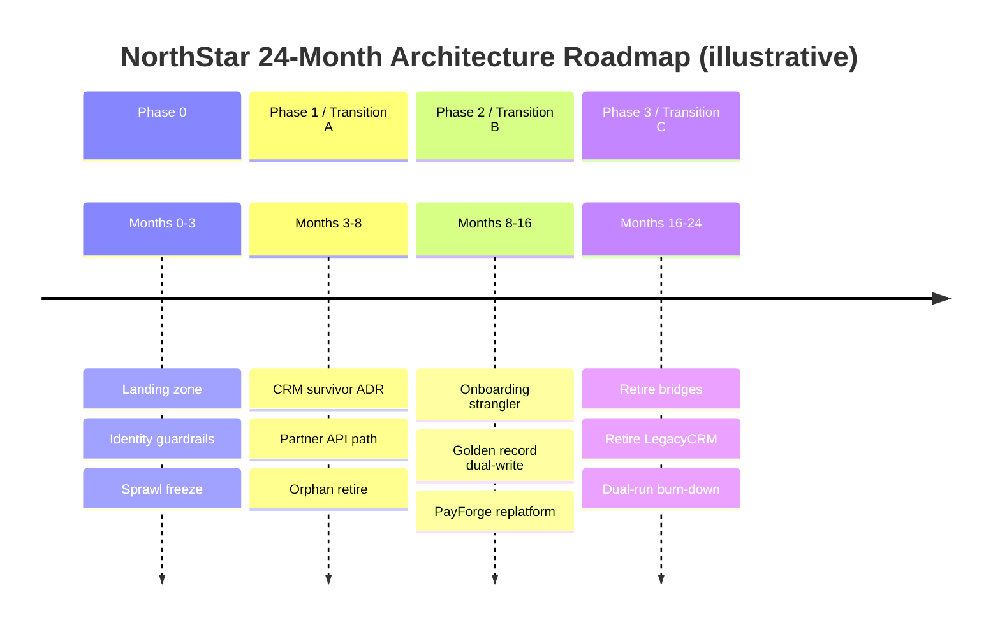

# Diagram 04 — Roadmap Waves

**Module:** 04  
**Use:** Lesson 4.4 / slides / lab

```mermaid
timeline
  title NorthStar 24-Month Architecture Roadmap (illustrative)
  section Phase 0
    Months 0-3 : Landing zone : Identity guardrails : Sprawl freeze
  section Phase 1 / Transition A
    Months 3-8 : CRM survivor ADR : Partner API path : Orphan retire
  section Phase 2 / Transition B
    Months 8-16 : Onboarding strangler : Golden record dual-write : PayForge replatform
  section Phase 3 / Transition C
    Months 16-24 : Retire bridges : Retire LegacyCRM : Dual-run burn-down
```

> NorthStar Financial Services is fictional. Dates are instructional.
