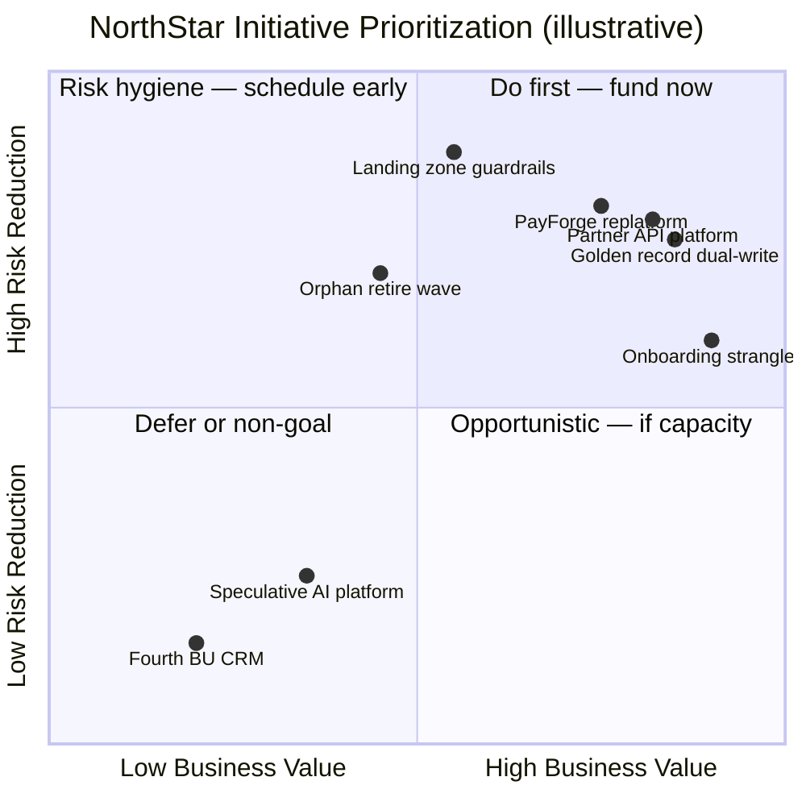

# Diagram 05 — Value versus Risk

**Module:** 04  
**Use:** Lesson 4.4 / executive roadmap conversations

```mermaid
quadrantChart
  title NorthStar Initiative Prioritization (illustrative)
  x-axis Low Business Value --> High Business Value
  y-axis Low Risk Reduction --> High Risk Reduction
  quadrant-1 Do first — fund now
  quadrant-2 Risk hygiene — schedule early
  quadrant-3 Defer or non-goal
  quadrant-4 Opportunistic — if capacity
  Partner API platform: [0.82, 0.78]
  Landing zone guardrails: [0.55, 0.88]
  Onboarding strangler: [0.90, 0.60]
  Orphan retire wave: [0.45, 0.70]
  Speculative AI platform: [0.35, 0.25]
  Fourth BU CRM: [0.20, 0.15]
  PayForge replatform: [0.75, 0.80]
  Golden record dual-write: [0.85, 0.75]
```

> Plot notes belong in the roadmap template; challenge sizes/effort verbally in class.
