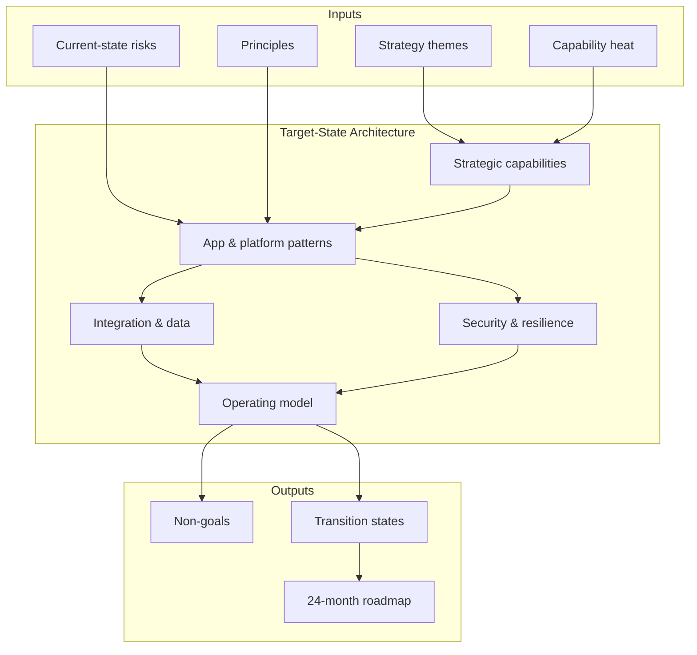

# Lesson 4.1 — Defining the Target State

**Module:** 04 — Target-State Architecture and Transformation Roadmaps  
**Duration:** ~25 minutes (live portion)  
**Learning objectives:** LO-4.1

---

## Opening hook (NorthStar)

Maya Chen (CIO) opens the executive committee with a slide titled “Target Architecture 2028.” It shows a single cloud, a single CRM, and “AI everywhere.” Elena Vos (Retail Banking president) asks: “Which of my acquired products still run next year—and who pays for the dual-run?” Raj Patel (CISO) asks: “Where do identity and audit evidence live during the journey?” You are NorthStar’s Lead Enterprise Architect. The room does not need a prettier vision slide. It needs a **defensible target state** tied to capabilities, principles, and constraints—plus an honest path through coexistence.

> **Fiction notice:** NorthStar Financial Services and named personas are fictional instructional constructs.

---

## Learning outcomes for this lesson

By the end of this lesson, students can:

1. Distinguish aspirational vision, target-state architecture, and funded transition commitment.
2. Compose a target-state definition from strategic capabilities, principles, constraints, and outcome metrics.

---

## Key concepts

### What “target state” means in EA practice

A **target-state architecture** is a coherent description of the future enterprise technology landscape that the organization intends to operate—typically on a 2–5 year horizon—expressed as:

- Capabilities enabled or strengthened
- Application and platform patterns (not every instance)
- Integration and data ownership models
- Security, identity, and resilience posture
- Operating principles and decision rights

It is **not**:

- A vendor product catalog
- A complete inventory rewrite
- A promise that everything will be greenfield
- A substitute for a funded program plan

### Inputs that must shape the target

| Input | Source at NorthStar | Failure mode if ignored |
| ----- | ------------------- | ----------------------- |
| Strategy themes | Cost −20%, faster onboarding, digital speed, resilience, cloud standardization, AI governance | Tech fashion projects |
| Capability heat | Module 02 map | Duplicate platforms per BU |
| Current constraints | Module 03 estate + debt | Unbuildable target |
| Principles | Module 01 draft | Inconsistent exceptions |
| Regulatory class of controls | Financial services obligations | Non-auditable designs |
| Funding reality | Phased value, not big-bang | Paper architecture |

### Target-state layers (practical stack)

1. **Business / capability layer** — which capabilities are strategic, which are commodity  
2. **Application & product layer** — systems of record, engagement, and differentiation  
3. **Integration & data layer** — APIs, events, master data, analytics readiness  
4. **Platform & cloud layer** — landing zone, shared services, FinOps guardrails  
5. **Security & resilience layer** — identity, controls, RTO/RPO class targets  
6. **Operating model layer** — ownership, ARB, golden paths, exception handling  

Target state must be coherent **across** layers. A modern CRM with point-to-point DB links and local identity silos is not a target—it is a new problem.

---

## Framework / model

**Target-State Definition Canvas (NorthStar)**

```text
┌─────────────────────────────────────────────────────────────┐
│ 1. Outcomes (what executives will measure)                  │
│ 2. Strategic capabilities (Invest / strengthen)             │
│ 3. Principles (rules that survive org charts)               │
│ 4. Constraints (budget, coexistence, skills, regulation)    │
│ 5. Architecture patterns (app / data / integration / cloud) │
│ 6. Explicit non-goals (what we will NOT do in 24 months)    │
│ 7. Success signals (exit criteria toward target)            │
└─────────────────────────────────────────────────────────────┘
```

Rule: if you cannot fill **non-goals** and **constraints**, your target state is marketing.

---

## Enterprise example (NorthStar)

**Illustrative target outcomes (24–36 month horizon):**

| Outcome | Metric direction |
| ------- | ---------------- |
| Operating cost | −20% run cost on consolidated platforms |
| Customer onboarding cycle time | Material reduction via unified onboarding journey |
| Release cycle | Shorter path-to-prod on golden paths |
| Resilience | Defined RTO/RPO for payment and onboarding critical paths |
| Integration | Prefer API/event over new file/DB links |
| Identity | Centralized workforce + customer identity patterns |
| AI | Governed use cases only; no shadow AI platforms |

**Illustrative target principles (examples students may refine):**

1. Capabilities over applications — fund capability outcomes, not pet systems.  
2. Prefer reuse of enterprise platforms before new product-local stacks.  
3. API- and event-first; batch/file only with explicit exception.  
4. Data has an owner; customer golden record is enterprise-owned.  
5. Security and resilience are designed in, not bolted on.  
6. Cloud accounts follow landing-zone standards; no uncontrolled sprawl.  
7. Coexistence is planned; dual-run has an end date and exit criteria.

**Target application architecture (pattern-level):**

- One strategic **customer engagement** pattern (consolidate duplicate CRMs)
- One **payments processing** core with clear system-of-record boundary
- Shared **partner integration** platform replacing multiple file bridges
- Shared **identity** and **observability** platforms
- Legacy **StarCore** retained/replatformed in waves—not rewritten in year one

---

## Trade-offs

| Option | Pros | Cons | When it fits |
| ------ | ---- | ---- | ------------ |
| Bold greenfield target | Clear narrative; attracts talent | High dual-run cost; political risk; skills gap | Narrow domain with strong sponsorship |
| Pattern-based target (recommended) | Scalable guidance; coexistence-friendly | Requires discipline to stop exceptions | Complex multi-BU estate like NorthStar |
| Vendor-defined target | Fast slides; partner support | Weak ownership; lock-in; poor capability fit | Commodity capability with strong governance |
| “Current + cloud” pseudo-target | Low conflict short-term | Encodes debt as strategy | Almost never for transformation funding |

---

## Common mistakes

- Writing a vision without **non-goals** and **constraints**
- Listing every future product as “target” without ownership or interfaces
- Treating target state as a project Gantt chart
- Ignoring regulatory evidence and identity during the journey
- Copying a reference architecture from another industry without NorthStar constraints

---

## Discussion prompts

1. Which NorthStar strategic theme should **dominate sequencing** in the first 12 months—and what does that force you to defer?
2. What belongs in the target state versus what belongs only in a transition state?

---

## Diagram (Mermaid)



---

## Transition to next lesson / lab

Once the target is defined as patterns + principles + outcomes, the next question is **how each current system gets there**. Lesson 4.2 introduces modernization strategies—including retain and consolidate—so students do not default to “rewrite everything.”

---

## References for instructors (non-proprietary)

- TOGAF-style ADM inspiration for baseline → target → transition (conceptual; do not require certification language)
- Course content standards and NorthStar baseline
- TIME model from Module 03 as input to disposition
