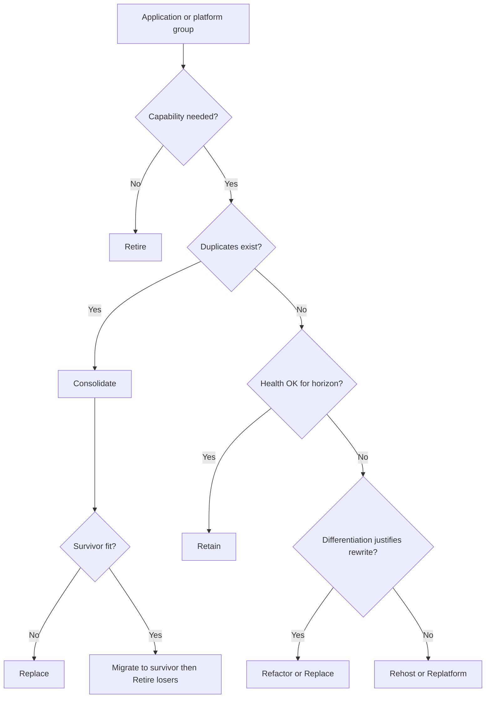

# Lesson 4.2 — Modernization Strategies

**Module:** 04 — Target-State Architecture and Transformation Roadmaps  
**Duration:** ~20 minutes (live portion)  
**Learning objectives:** LO-4.2

---

## Opening hook (NorthStar)

Marcus Webb (Platform / SRE) proposes “lift everything to cloud this year.” Priya Nair (Data) wants a customer master rewrite before any CRM consolidation. A product team wants to replace PayForge with a new build because “microservices.” You must choose **disposition strategies** that executives can fund—and that operations can survive.

> **Fiction notice:** NorthStar Financial Services and named personas are fictional.

---

## Learning outcomes for this lesson

By the end of this lesson, students can:

1. Apply the seven modernization strategies used in this course to NorthStar application groups.
2. Justify retain / replace / consolidate / retire decisions with cost, risk, coupling, and capability fit.

---

## Key concepts

### The seven strategies (course canonical set)

| Strategy | Meaning | Typical NorthStar use |
| -------- | ------- | --------------------- |
| **Rehost** | Move as-is to new infrastructure (lift-and-shift) | Stable batch apps needing data-center exit |
| **Replatform** | Minor cloud/platform optimizations without rewriting core | StarCore middleware to managed DB/runtime |
| **Refactor** | Significant code/architecture change for agility or cost | Onboarding services extracted from monolith |
| **Replace** | New product/platform; migrate off old | Duplicate CRM → enterprise CRM pattern |
| **Retire** | Decommission; capability absorbed elsewhere | Orphaned acquired reporting tools |
| **Retain** | Keep running with controlled investment | Regulatory-stable core with low change rate |
| **Consolidate** | Merge duplicate capabilities/platforms onto one | Multiple file-transfer platforms → one |

**Relationship to TIME (Module 03):**

| TIME | Often maps to |
| ---- | ------------- |
| Tolerate | Retain (with constraints) |
| Invest | Refactor / Replatform / selective Replace |
| Migrate | Rehost / Replatform / Replace / Consolidate |
| Eliminate | Retire |

TIME is a **portfolio lens**. The seven strategies are **execution choices**. Do not treat them as identical.

### Decision dimensions

Score each candidate (1–5) and write the trade-off:

1. **Business criticality** of the capability  
2. **Technical health** and change cost  
3. **Coupling** (integrations, data, org skills)  
4. **Regulatory / audit burden** of change  
5. **Dual-run cost** if replaced  
6. **Strategic differentiation** (build vs buy pressure)  
7. **Skills readiness** of the owning team  

High criticality + poor health + high coupling → often **replatform + strangler**, not big-bang replace.

### Consolidate vs replace

At NorthStar, acquired companies created **duplicate capabilities**. Consolidate means selecting a **survivor pattern** and migrating users/data—not keeping three “retained” CRMs forever. Replace may be required when no survivor is fit. Retire is the end state for losers of consolidation.

---

## Framework / model

**Strategy selection tree (simplified)**

```text
Is the capability still needed?
  NO  → Retire (plan data retention + access)
  YES → Are there duplicates?
          YES → Consolidate (pick survivor or Replace all)
          NO  → Is tech health acceptable for strategic horizon?
                  YES → Retain (+ Tolerate investment guardrails)
                  NO  → Is rewrite justified by differentiation?
                          YES → Refactor or Replace
                          NO  → Rehost or Replatform to buy time
```

Always document: **what we are optimizing for** (cost, speed, risk, CX).

---

## Enterprise example (NorthStar)

| Application / group (fictional) | Suggested strategy | Rationale sketch |
| ------------------------------- | ------------------ | ---------------- |
| StarCore Banking Suite | Retain + Replatform (waves) | System of record; high coupling; skills scarce |
| PayForge (acquired payments) | Replatform then selective Refactor | Critical path; avoid full rewrite year 1 |
| NovaCRM + LegacyCRM | Consolidate → Replace loser | Duplicate customer engagement capability |
| OnboardX + BU onboarding portals | Refactor + Consolidate journey | Strategic CX theme |
| PartnerLink Classic + FileBridge + SyncHub | Consolidate to API/event platform | Cost + partner cycle time |
| Shadow reporting cubes (3) | Retire | Capability moved to governed analytics |
| Stable HR batch payroll feed | Rehost | Commodity; low change; facility exit |

---

## Trade-offs

| Option | Pros | Cons | When it fits |
| ------ | ---- | ---- | ------------ |
| Rehost | Fast facility exit; low app change | Encodes debt; weak cloud value | Deadline-driven exit; stable apps |
| Replatform | Better ops/cost with limited rewrite | Still limited agility | Core systems needing managed services |
| Refactor | Improves speed/quality where it matters | Costly; needs strong product ownership | Differentiating digital journeys |
| Replace | Clean break; vendor leverage | Dual-run; data migration risk | Unfit duplicate or EOL platform |
| Retire | Direct cost removal | Political; hidden dependencies | True elimination after consolidate |
| Retain | Protects stability; lower near-term spend | Can become permanent avoidance | Healthy enough + non-strategic |
| Consolidate | Cuts duplicates; clearer ownership | Winner/loser politics; migration waves | Multi-acquisition estates |

---

## Common mistakes

- Using “migrate to cloud” as if it were a strategy (it is a destination, not a disposition)
- Replacing everything labeled “legacy” without dual-run economics
- Retaining duplicates to avoid conflict (creates permanent cost)
- Refactoring commodity systems that should be replaced or retired
- Ignoring data and identity when choosing replace/consolidate

---

## Discussion prompts

1. When is **retain** a courageous architecture decision rather than avoidance?
2. For NorthStar’s three file-transfer platforms, what evidence would tip you from consolidate-to-survivor versus replace-with-new platform?

---

## Diagram (Mermaid)



---

## Transition to next lesson / lab

Strategies are chosen per group—but the estate cannot jump to target overnight. Lesson 4.3 covers **transition architectures**: interim operating states with coexistence, stranglers, and exit criteria.

---

## References for instructors (non-proprietary)

- Industry “6R/7R” migration strategy language (AWS and others)—teach concepts, not vendor lock-in
- Strangler fig pattern (Martin Fowler) for incremental replace/refactor
- Course TIME model and NorthStar baseline
