# Lesson 4.3 — Transition Architectures

**Module:** 04 — Target-State Architecture and Transformation Roadmaps  
**Duration:** ~20 minutes (live portion)  
**Learning objectives:** LO-4.3

---

## Opening hook (NorthStar)

Elena Vos agrees to consolidate CRMs—but refuses a six-month freeze on retail campaigns. Raj Patel will not approve a customer master cutover without dual-write audit evidence. The Lead EA must design **transition architectures**: interim states that are intentionally temporary, operationally safe, and exit-gated.

> **Fiction notice:** NorthStar Financial Services and named personas are fictional.

---

## Learning outcomes for this lesson

By the end of this lesson, students can:

1. Define transition architecture as a managed interim state with entry/exit criteria.
2. Design at least three NorthStar transition states that manage coexistence, dual-run, and risk.

---

## Key concepts

### Transition architecture defined

A **transition architecture** is a deliberately designed interim landscape between current and target state. It includes:

- Which systems remain authoritative
- Which interfaces are temporary (anti-corruption layers, dual-write, sync jobs)
- What security/compliance evidence looks like during coexistence
- Exit criteria that unlock the next wave
- Explicit “technical debt we accept for N months”

Without exit criteria, “temporary” becomes permanent architecture.

### Why NorthStar needs multiple transitions

Constraints force waves:

- Acquired systems cannot all be replaced in year one
- Skills for platforms and cloud must grow incrementally
- Budget requires phased value realization
- Regulatory evidence must remain continuous

A single “Year 2 target” slide without transitions is not executable architecture leadership.

### Coexistence patterns (toolbox)

| Pattern | Use when | Risk to watch |
| ------- | -------- | ------------- |
| Strangler | Gradually replace modules behind façade | Incomplete strangler; permanent façade |
| Dual-run / dual-write | Cutover confidence for critical data | Divergence; reconciliation cost |
| Anti-corruption layer | Protect new domain from legacy models | Becomes permanent integration spaghetti |
| Parallel read / single write | Analytics or CX reads while write stays legacy | Stale reads; cache consistency |
| Feature flag / canary | Progressive traffic shift | Observability gaps |
| Bridge integration | Temporary file/API bridge during consolidate | Shadow IT extends bridge life |

### Exit criteria (examples)

Good exit criteria are **observable**:

- “≥80% partner volume on API gateway; FileBridge read-only”
- “LegacyCRM write path disabled; NovaCRM is system of engagement”
- “All new cloud accounts created only via landing-zone pipeline”
- “Customer golden record stewardship assigned; duplicate create blocked”

Bad exit criteria: “CRM project complete,” “cloud migration done,” “teams aligned.”

---

## Framework / model

**Three-state minimum (course requirement)**

```text
Current (T0)
    │  Wave A — foundation + quick risk/cost wins
    ▼
Transition A — platforms & guardrails; limited consolidations
    │  Wave B — strategic journeys (onboarding, partners)
    ▼
Transition B — coexistence with shrinking dual-run
    │  Wave C — retire losers; harden target patterns
    ▼
Target (pattern-level; continuous improvement remains)
```

Students may name states differently but must define **three interim checkpoints** before full target pattern adoption.

---

## Enterprise example (NorthStar)

### Transition A — “Stabilize and standardize” (months 0–8)

- Landing-zone and identity guardrails for new workloads
- Inventory-driven retire of obvious orphans
- Select CRM survivor; begin read consolidation
- File platforms: freeze new partners on FileBridge; route new partners to API path
- StarCore: retain; start replatform discovery

**Exit:** Guardrails live; CRM survivor ADR approved; partner API path carrying new volume.

### Transition B — “Strategic journeys coexist” (months 8–16)

- Onboarding journey strangler around OnboardX
- Dual-write customer golden record with reconciliation
- PayForge replatform complete for critical path; selective refactor of APIs
- LegacyCRM write freeze; migration waves for remaining BUs

**Exit:** Onboarding cycle-time KPI improvement demonstrated; LegacyCRM write-off plan dated; dual-write reconciliation error rate below threshold.

### Transition C — “Shrink dual-run” (months 16–24)

- Retire FileBridge and SyncHub after volume drain
- Retire LegacyCRM
- Remove temporary bridges; promote anti-corruption layers only where still justified
- Target patterns become default golden paths

**Exit:** Dual-run cost below agreed threshold; retired systems decommissioned with evidence; target principles enforced via ARB + guardrails.

---

## Trade-offs

| Option | Pros | Cons | When it fits |
| ------ | ---- | ---- | ------------ |
| Few large transitions | Simpler story | Bigger blast radius | Strong sponsorship, low coupling |
| Many small transitions | Safer learning | Coordination overhead | NorthStar-like complexity |
| Long dual-run | Lower cutover fear | Cost & complexity explode | Only with hard end dates |
| Big-bang cutover | Short coexistence | High operational/regulatory risk | Rarely for core banking/payments |

---

## Common mistakes

- Designing transitions as project phases without architecture content
- Omitting identity, audit, and data ownership from interim states
- Accepting bridges without retirement dates
- Declaring target reached while dual-run still funds three platforms
- Skipping Transition A foundation (guardrails) and jumping to app rewrites

---

## Discussion prompts

1. What would force NorthStar to insert a fourth transition state?
2. How should the ARB treat a BU request that extends a “temporary” bridge by 12 months?

---

## Diagram (Mermaid)

```mermaid
flowchart LR
  subgraph T0 [Current]
    A1[Duplicate CRMs]
    A2[Multi file bridges]
    A3[Account sprawl]
  end
  subgraph TA [Transition A]
    B1[Landing zone + identity]
    B2[CRM survivor chosen]
    B3[New partners on API]
  end
  subgraph TB [Transition B]
    C1[Onboarding strangler]
    C2[Golden record dual-write]
    C3[LegacyCRM write freeze]
  end
  subgraph TC [Transition C / Target patterns]
    D1[Single engagement pattern]
    D2[Shared integration platform]
    D3[Retire bridges and losers]
  end
  T0 --> TA --> TB --> TC
```



---

## Transition to next lesson / lab

Transitions define **what** interim landscapes look like. Lesson 4.4 packages initiatives into a **24-month roadmap** with dependencies, funding logic, and value-versus-risk sequencing for executives.

---

## References for instructors (non-proprietary)

- Transition architecture concept (enterprise architecture practice)
- Strangler and coexistence patterns
- NorthStar constraints: coexistence, phased value, skills ramp
