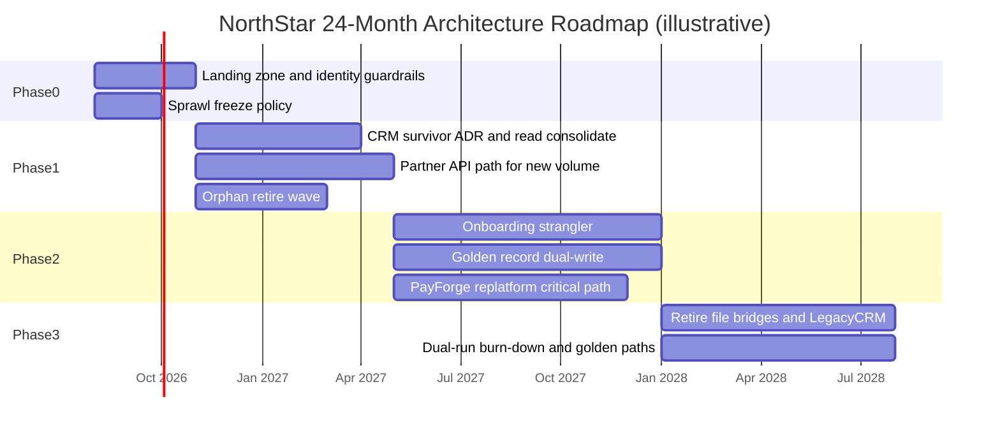

# Lesson 4.4 — Architecture Roadmaps

**Module:** 04 — Target-State Architecture and Transformation Roadmaps  
**Duration:** ~20 minutes (live portion) + lab handoff  
**Learning objectives:** LO-4.4

---

## Opening hook (NorthStar)

The CFO will not fund “architecture modernization.” The CFO will fund **phased outcomes**: lower run cost, faster onboarding, fewer critical outages, measurable consolidation. Your 24-month roadmap must show **value per wave**, **dependencies**, and **risks**—not a list of technology projects.

> **Fiction notice:** NorthStar Financial Services is fictional.

---

## Learning outcomes for this lesson

By the end of this lesson, students can:

1. Build a 24-month architecture roadmap with phases, dependencies, and value claims.
2. Prioritize initiatives using a value-versus-risk lens suitable for executive challenge.

---

## Key concepts

### Roadmap vs project plan vs backlog

| Artifact | Answers | Owner mindset |
| -------- | ------- | ------------- |
| Architecture roadmap | What landscapes and capability outcomes, in what order, why | EA + executives |
| Program plan | How work is delivered, teams, dates, budget detail | PMO / product |
| Engineering backlog | Sprint-level implementation | Delivery teams |

EAs who submit only Jira epics abdicate the leadership conversation. EAs who ignore delivery constraints produce fiction.

### Sequencing principles (NorthStar)

1. **Foundation before fashion** — landing zone, identity, observability before speculative AI platforms  
2. **Risk and cost early where cheap** — retire orphans; freeze sprawl  
3. **Strategic journeys next** — onboarding, payments reliability, partner APIs  
4. **Dependencies explicit** — golden record before full CRM cutover; API platform before partner migration  
5. **Value every 6–8 months** — executives need evidence, not a 24-month cliff  
6. **Dual-run has a burn-down** — cost of coexistence must trend down  

### Value-versus-risk matrix

Plot initiatives:

- **X-axis:** Business value / strategic alignment (1–5)  
- **Y-axis:** Risk reduction (security, resilience, compliance, concentration) (1–5)  
- **Size or label:** Effort / cost (1–5)  

Prioritize high-value + high-risk-reduction with manageable effort first. High-effort/low-value items become non-goals or later waves.

### Executive summary structure (required in lab)

1. Problem and strategic ask (3–5 lines)  
2. Target-state headline  
3. Three transition checkpoints  
4. 24-month waves and value per phase  
5. Top risks and asks (decisions, funding, policy)  

---

## Framework / model

**24-month wave template**

```text
Phase 0  (M0–M3)   Foundation & freeze sprawl
Phase 1  (M3–M8)   Transition A value: cost + risk hygiene
Phase 2  (M8–M16)  Transition B value: CX + partner speed
Phase 3  (M16–M24) Transition C value: retire dual-run; harden target
```

Each phase row must include: theme, business value, risk reduced, major deliverables, dependencies, funding note.

---

## Enterprise example (NorthStar)

| Phase | Theme | Business value | Risk reduced |
| ----- | ----- | -------------- | ------------ |
| 0 | Guardrails | Stop cost and account sprawl growth | Unmanaged cloud & identity drift |
| 1 | Consolidate & retire easy wins | Early run-cost takeout | Orphan systems; file sprawl growth |
| 2 | Onboarding + partner APIs | Cycle-time & partner experience | Fragile point-to-point integrations |
| 3 | Retire losers / harden | Dual-run cost down; target default | Concentration & compliance evidence gaps |

**Dependency example:** “Partner API platform (Phase 1) blocks PartnerLink volume drain (Phase 2–3).”

---

## Trade-offs

| Option | Pros | Cons | When it fits |
| ------ | ---- | ---- | ------------ |
| Value-first sequencing | Executive support; early proof | May defer deep risk | Strong CFO pressure |
| Risk-first sequencing | CISO/compliance allies | Slower visible CX wins | Material control gaps |
| Balanced waves (recommended) | Coalition funding | Harder storytelling | NorthStar default |
| Big-bang Year 2 | Simple slide | Funding & ops failure risk | Almost never |

---

## Common mistakes

- Roadmap as a dump of every team’s wish list  
- No dependencies or “everything starts Month 1”  
- Value stated as “modernization” without KPI direction  
- Ignoring operational capacity (change freeze seasons, year-end)  
- Hiding dual-run cost so executives are surprised in Month 14  

---

## Discussion prompts

1. If the CFO cuts 30% of transformation funding, which Phase 2 items survive—and what target outcomes do you renegotiate?
2. How do you prevent the roadmap from becoming a political scoreboard for BU presidents?

---

## Diagram (Mermaid)



---

## Transition to next lesson / lab

You now have the full Module 04 toolkit. Lab 04 asks you to produce NorthStar’s target-state roadmap package: principles, dispositions, three transitions, 24-month plan, risks, and executive summary.

Next module (05) will deepen **cloud and platform strategy**—consuming the foundation items you place on this roadmap.

---

## References for instructors (non-proprietary)

- Architecture roadmap vs program plan distinctions
- Value-versus-risk prioritization for portfolio sequencing
- NorthStar strategic themes and constraints
