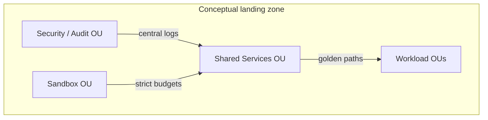

# Lesson 5.2 — Landing Zones and Shared Platform Capabilities

**Module:** 05 — Cloud and Platform Strategy  
**Duration:** ~25 minutes  
**Learning objectives:** M5-LO2, M5-LO5

---

## Opening hook (NorthStar)

Security asks: “Who owns the audit trail?” Finance asks: “Why are sandbox accounts spending like production?” Platform engineering asks: “Which golden paths exist?” Without a landing-zone model, every team invents a private cloud.

---

## Learning outcomes for this lesson

1. Sketch a conceptual multi-account landing zone for NorthStar (not a full Control Tower deep dive).
2. Produce a platform capability map with ownership and golden-path intent.

---

## Key concepts

### Landing zone (canonical definition)

A **landing zone** is a foundational multi-account cloud environment with guardrails—identity, networking patterns, logging, baselines—so product teams can deliver safely.

### Shared services vs. product accounts

| Account / OU purpose | Examples | Guardrails |
| -------------------- | -------- | ---------- |
| Security / audit | Log archive, security tooling | Strict write controls |
| Shared services | Identity integration, CI runners (concept) | Change control |
| Workload prod/nonprod | Payments API, onboarding apps | Tags, budgets, encryption |
| Sandbox | Experiments | Hard spend limits, auto-expire |

### Platform capability map

Capabilities (examples): identity federation, network patterns, observability, secrets, CI/CD baselines, policy-as-code, FinOps tagging, backup baselines.

Mark each: **Provide via platform?** **Golden path?** **Build / buy / reuse?**

---

## Framework / model

```text
Org structure (OUs) → Account vending → Baseline controls → Golden paths → Product autonomy
```

---

## Enterprise example (NorthStar)

NorthStar’s acquired companies still operate separate cloud “islands.” Target: one enterprise landing-zone standard with phased account migration—not a big-bang account merge.

Lab 05 implements a **thin slice** of foundation controls in a single account (audit bucket, trail optional, budget, SSM config, health API) to teach the *shape* of platform control without Control Tower complexity/cost.

---

## Trade-offs

| Option | Pros | Cons | When it fits |
| ------ | ---- | ---- | ------------ |
| Heavy central platform day-1 | Strong control | Slow delivery; political resistance | High regulatory urgency |
| Thin platform + fast golden paths | Value sooner | Temporary inconsistency | Typical transformation start |
| No platform; standards PDFs only | Cheap on paper | Non-compliance in practice | Never for NorthStar scale |

---

## Common mistakes

- Drawing landing-zone diagrams with no owners
- Platform teams building services nobody adopts
- Treating sandboxes as permanent free compute

---

## Discussion prompts

1. Which three platform capabilities must exist before NorthStar accelerates migration waves?
2. How do you prevent the platform team from becoming a ticket bottleneck?

---

## Diagram (Mermaid)



---

## Transition

Next: **build versus buy** for platform capabilities—ADRs that executives can fund.
