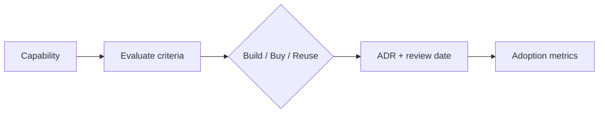

# Lesson 5.3 — Build versus Buy for Platform Services

**Module:** 05 — Cloud and Platform Strategy  
**Duration:** ~20 minutes  
**Learning objectives:** M5-LO3

---

## Opening hook (NorthStar)

A platform squad proposes building a custom internal developer portal in 18 months. A vendor offers a commercial offering in 90 days. Engineering wants open-source glue. Finance wants TCO. Your ADR must choose—and name the exit criteria.

---

## Learning outcomes for this lesson

1. Apply a weighted build-versus-buy assessment to a platform capability.
2. Write an ADR that states recommendation, alternatives, and risks.

---

## Key concepts

### Platform capabilities are products

Treat observability, CI baselines, and secrets platforms as products with customers (engineering teams), SLOs, and adoption metrics—not science projects.

### Decision criteria (weight to 100%)

Strategic differentiation, time to value, 3-year TCO, security/compliance fit, operability/skills, integration fit, lock-in/exit cost, data control, roadmap alignment.

### Patterns of good ADRs

- Decision in one sentence
- Alternatives considered (at least two)
- Consequences (positive and negative)
- Review date / exit criteria

---

## Framework / model

Use course template: `student/templates/17-build-versus-buy.md` → `student/templates/01-architecture-decision-record.md`.

---

## Enterprise example (NorthStar)

Candidate decisions for the cohort:

| Capability | Likely recommendation (teaching default) | Rationale sketch |
| ---------- | ---------------------------------------- | ---------------- |
| Cloud audit logging | Buy/use provider native (CloudTrail) + shared archive | Commodity; differentiate elsewhere |
| Internal developer portal | Buy or adopt mature OSS; thin custom UX | Time to value |
| Payments core processing | Build/extend (differentiation) | Not a platform commodity |

---

## Trade-offs

| Option | Pros | Cons | When it fits |
| ------ | ---- | ---- | ------------ |
| Build | Control, fit | Cost, talent, delay | True differentiator |
| Buy | Speed, support | Lock-in, fit gaps | Commodity platforms |
| Reuse existing | Leverages sunk cost | May encode bad patterns | When good enough and owned |

---

## Common mistakes

- Scoring only “features” and ignoring operability
- Choosing build because “we can”
- No exit criteria for vendor decisions

---

## Discussion prompts

1. Is an internal developer portal a differentiator for NorthStar—or table stakes?
2. What evidence would reverse a “buy” decision after 12 months?

---

## Diagram (Mermaid)

---

## Transition

FinOps turns platform strategy into **economic governance**—budgets, tags, and lifecycle.
