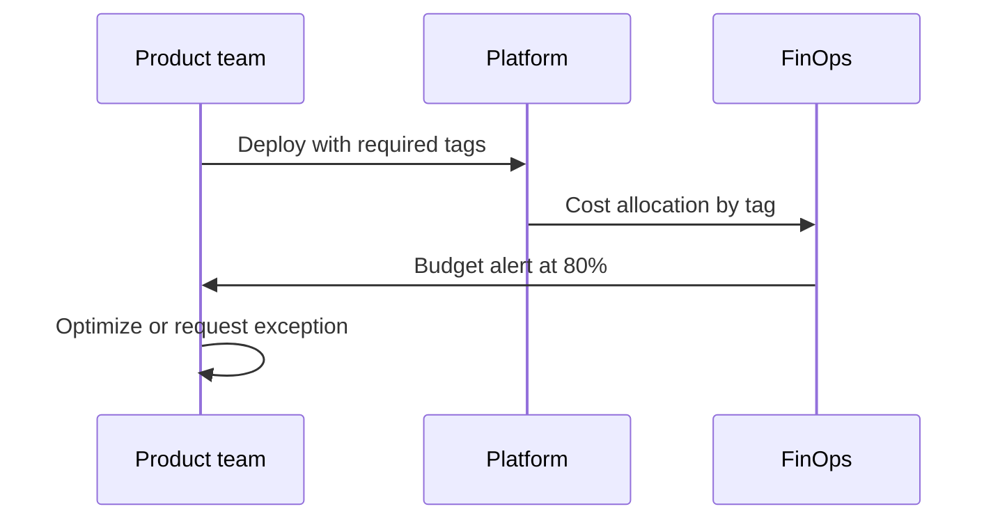

# Lesson 5.4 — FinOps, Guardrails, and Executive Storytelling

**Module:** 05 — Cloud and Platform Strategy  
**Duration:** ~20 minutes + lab bridge  
**Learning objectives:** M5-LO4, M5-LO5

---

## Opening hook (NorthStar)

Finance cannot explain a 35% cloud bill increase. Engineering cannot show which product owns which spend. The CEO asks the Lead EA for a one-slide answer. Without tags, budgets, and lifecycle policy, there is no architecture—only receipts.

---

## Learning outcomes for this lesson

1. Define a minimal FinOps policy (tagging, budgets, expiration, cleanup).
2. Connect lab controls (budget, tags, lifecycle) to executive narrative.

---

## Key concepts

### FinOps as architecture

FinOps is not “finance’s problem.” Architects design **allocation, accountability, and feedback loops** into platforms.

### Minimal viable FinOps for NorthStar labs / early platforms

| Control | Mechanism | Owner |
| ------- | --------- | ----- |
| Tagging standard | Required tags on all resources | Platform + EA |
| Budgets / alerts | Account and tag-based budgets | FinOps + platform |
| Service lifecycle | Expire lab / sandbox resources | Platform |
| Showback | Monthly product cost views | Finance partner |

### Guardrails vs. gates

- **Guardrail:** automated preventive control (SCP, budget alert, encryption default)
- **Gate:** human review checkpoint (ARB for high-risk exceptions)

Prefer guardrails for scale; use gates for rare, high-impact exceptions.

---

## Framework / model

```text
Tag → Allocate → Alert → Act → Learn (FinOps cycle)
```

---

## Enterprise example (NorthStar)

Lab 05 required tags:

```text
Project=BayLearn
Course=EnterpriseArchitectureLeadership
Module=05
Student=<id>
Environment=Lab
ExpirationDate=<YYYY-MM-DD>
```

Executive story: “We will not fund migration waves without tagging, budgets, and a shared audit trail. The lab proves the control shape at low cost.”

---

## Trade-offs

| Option | Pros | Cons | When it fits |
| ------ | ---- | ---- | ------------ |
| Strict central budgets | Cost control | Friction | Early chaos |
| Product-owned showback | Accountability | Needs clean tags | After baseline tags |
| Optional AWS Config everywhere | Deep compliance evidence | Ongoing cost | Selective, not default lab |

---

## Common mistakes

- Budgets without owners who must act
- Tags applied inconsistently (breaks showback)
- Leaving lab trails/config running “to study later”

---

## Discussion prompts

1. Who should be paged when a product budget hits 80%—and what action is expected within 48 hours?
2. How do you explain to a BU president that sandbox freedom requires expiration dates?

---

## Diagram (Mermaid)



---

## Transition to lab

Deploy the platform foundation: audit bucket, optional CloudTrail, IAM, DynamoDB, Lambda health API, SSM params, budget. Then write the strategy artifacts that explain *why* those controls exist.
