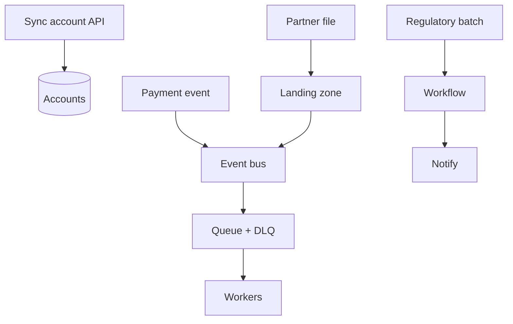

# Lesson 6.1 — Integration Pattern Selection

**Module:** 06 — Integration, Application, and Data Architecture  
**Duration:** ~25 minutes  
**Learning objectives:** M6-LO1, M6-LO5

---

## Opening hook (NorthStar)

Partner onboarding still depends on three SFTP servers, two nightly batch jobs, and a point-to-point database link nobody wants to own. Payments need near-real-time fraud signals. Customer service needs synchronous account lookups. One “ESB for everything” proposal appears in email. Your job: **pattern selection with trade-offs**, not theology.

> Fiction notice: NorthStar Financial Services is fictional.

---

## Learning outcomes

1. Use a pattern matrix across latency, coupling, volume, reliability, security, cost, ops complexity.
2. Recommend primary/secondary patterns per NorthStar interface class.

---

## Key concepts

### Pattern families

| Pattern | Typical fit |
| ------- | ----------- |
| Synchronous API | Request/response, low latency user paths |
| Async events | Fan-out facts (“PaymentSubmitted”) |
| Queue / competing consumers | Work distribution + buffering |
| Streaming | High-volume continuous signals |
| File / SFTP batch | Partner ecosystems, bulk exchange |
| Batch ETL | Regulatory/analytics windows |
| Shared database | Discouraged—hidden coupling |

### Selection is multi-criteria

Never choose “events” because they are modern. Choose because coupling, failure modes, and ops match the business SLA.

---

## Framework

Use `student/templates/16-integration-pattern-matrix.md`.

```text
Interface context → score patterns → pick primary/secondary → failure handling → ADR
```

---

## Enterprise example (NorthStar)

| Interface | Primary pattern | Secondary |
| --------- | --------------- | --------- |
| Account lookup/create | Sync API | Events on create |
| Payment submitted | Events → queue workers | API for status read |
| Partner files | File landing (S3 sim / SFTP) | Events on arrival |
| Regulatory reporting | Orchestrated batch (workflow) | Manual fallback |

---

## Trade-offs

| Option | Pros | Cons | When it fits |
| ------ | ---- | ---- | ------------ |
| Sync API everywhere | Simple mental model | Tight coupling; cascading failures | Narrow read paths |
| Events everywhere | Decoupling | Eventual consistency complexity | Facts that many consumers need |
| Files for all partners | Matches partner reality | Latency; ops toil | Ecosystem constraints |

---

## Common mistakes

- ESB/monolith hub as default
- Ignoring DLQs and poison messages
- Treating Transfer Family as free

---

## Discussion prompts

1. Which NorthStar flow must stay synchronous—and why?
2. What breaks if payment events are lost for 15 minutes?

---

## Diagram



---

## Transition

Next: **application domains and ownership**—who owns the API vs the bus vs the data product.
