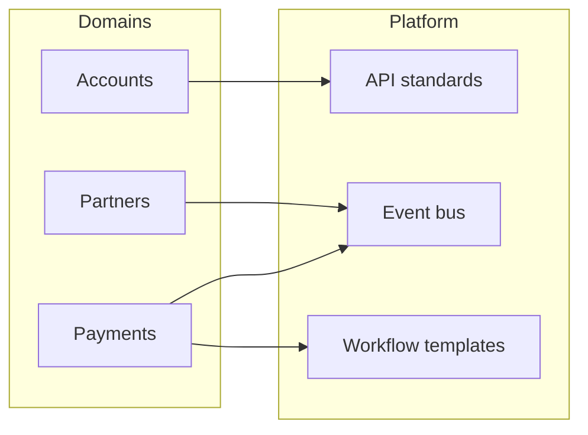

# Lesson 6.2 — Application Domains and Platform Boundaries

**Module:** 06  
**Duration:** ~20 minutes  
**Learning objectives:** M6-LO2

---

## Opening hook (NorthStar)

The payments product team wants to own “all integration.” The platform team wants a central bus. Customer domain claims account master data. Without boundaries, every incident becomes an ownership argument.

---

## Learning outcomes

1. Separate product domains from shared integration platform capabilities.
2. Define RACI-style ownership for APIs, events, and schemas.

---

## Key concepts

### Domains (teaching cut)

| Domain | Examples | Owns |
| ------ | -------- | ---- |
| Customer / Accounts | Account API, profile | Account lifecycle APIs + account data product |
| Payments | Payment submission, settlement signals | Payment events + payment status |
| Partner | Onboarding files, partner profiles | File contracts + partner metadata |
| Shared integration platform | Event bus, queues, workflow templates, API gateway standards | Golden paths, reliability patterns |

### Platform boundary rule

Product teams own **business semantics**. Platform owns **reusable integration mechanisms** and standards—not the meaning of “PaymentSubmitted.”

---

## Framework

```text
Domain ownership → Interface contracts → Platform golden paths → Observability & DLQ standards
```

---

## Trade-offs

| Option | Pros | Cons | When it fits |
| ------ | ---- | ---- | ------------ |
| Central integration team owns all APIs | Consistency | Bottleneck | Early cleanup only |
| Fully federated anything-goes | Speed | Chaos | Never at NorthStar scale |
| Federated domains + platform golden paths | Balance | Needs governance | Target model |

---

## Common mistakes

- Platform rewriting business payloads “to help”
- Domains bypassing DLQ standards
- No schema ownership for events

---

## Discussion prompts

1. Who should approve a breaking change to `PaymentSubmitted`?
2. Where does API Gateway policy live—platform or product?

---

## Diagram


