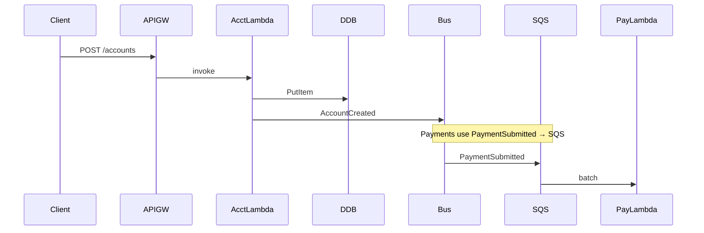

# Lesson 6.4 — Reference Architecture Leadership and Lab Bridge

**Module:** 06  
**Duration:** ~20 minutes + lab  
**Learning objectives:** M6-LO4, M6-LO5

---

## Opening hook (NorthStar)

You must show the Architecture Review Board a **reference architecture** that covers: real-time account APIs, payment events, partner SFTP files, regulatory batches, analytics steps, and notifications—without proposing a million-dollar bus project on day one.

---

## Learning outcomes

1. Explain the lab’s AWS mapping to each business pattern.
2. Defend S3 simulation vs Transfer Family with cost/ops trade-offs.

---

## Key concepts

### Lab mapping

| Business need | Lab implementation |
| ------------- | ------------------ |
| Real-time account APIs | API Gateway → Lambda → DynamoDB (+ emit events) |
| Payment events | EventBridge → SQS (+ DLQ) → Lambda |
| Partner SFTP files | **S3 `incoming/` simulation** (Transfer Family optional/conceptual) |
| Regulatory batches | Step Functions → analytics Lambda → SNS |
| Notifications | SNS email |

### Transfer Family cost warning

Continuous SFTP endpoints cost money even when idle. For class, simulate partner arrival with S3 puts. Document when real Transfer Family (or managed SFTP) is justified in production.

---

## Trade-offs

| Option | Pros | Cons | When it fits |
| ------ | ---- | ---- | ------------ |
| S3 landing simulation | Cheap, fast labs | Not full SFTP protocol fidelity | Teaching + many internal landings |
| AWS Transfer Family | Protocol compatibility | Hourly cost, ops | Real external SFTP mandates |
| MFT vendor | Enterprise features | Cost/lock-in | Complex partner ecosystems |

---

## Common mistakes

- Leaving queues/state machines running unused for weeks
- Public write APIs without auth in “temporary” labs that become permanent
- Skipping DLQ design in event narratives

---

## Discussion prompts

1. What production control would you add before exposing account POST externally?
2. How does this reference architecture change if payment volume grows 100×?

---

## Diagram

---

## Transition to lab

Deploy, exercise each path, complete pattern matrix + ADRs, then destroy.
