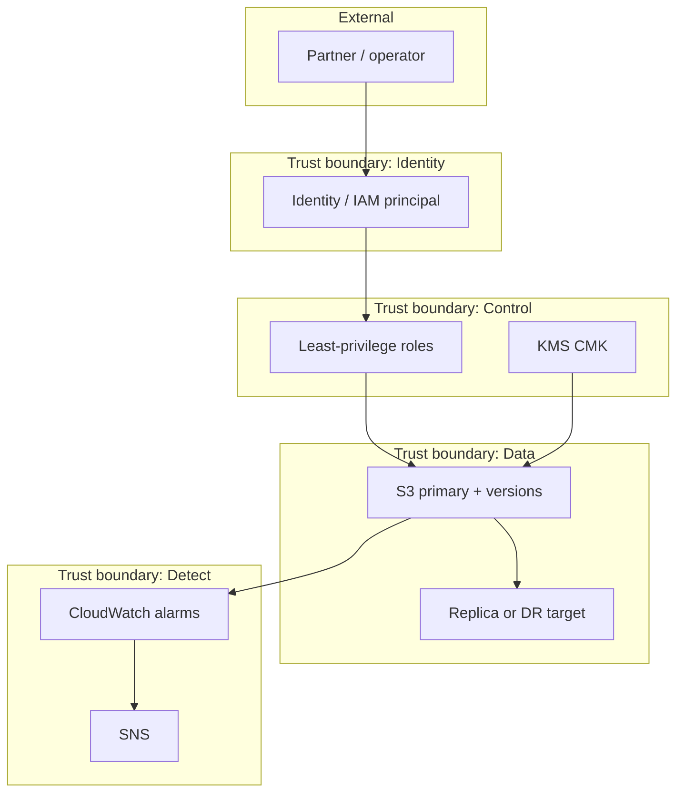
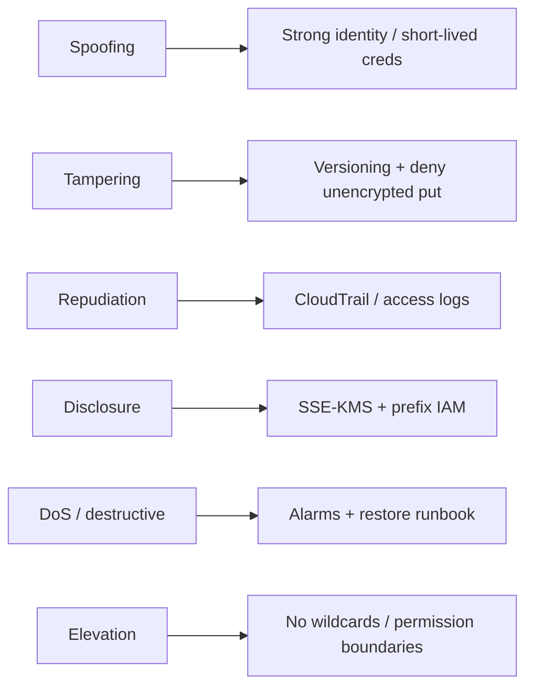
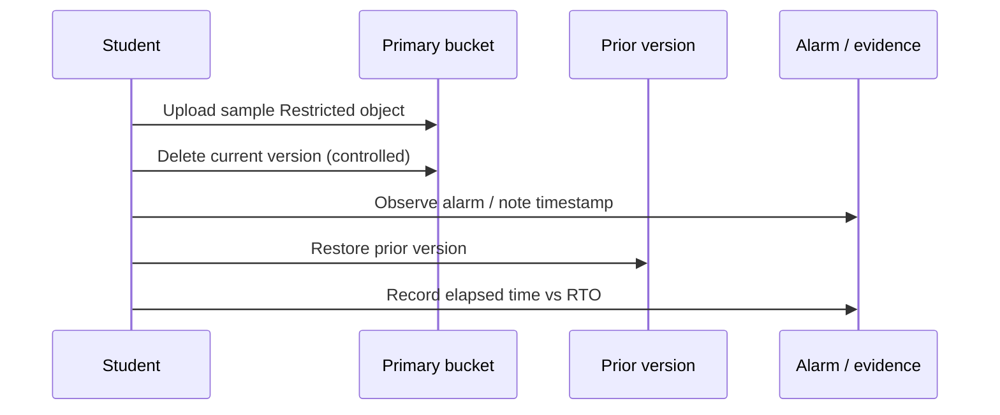

# Diagrams — Module 07

Mermaid sources for slides and labs. NorthStar Financial Services is fictional.

---

## 01 — Trust boundaries (platform slice)

---

## 02 — STRIDE to controls

---

## 03 — Recovery drill flow

