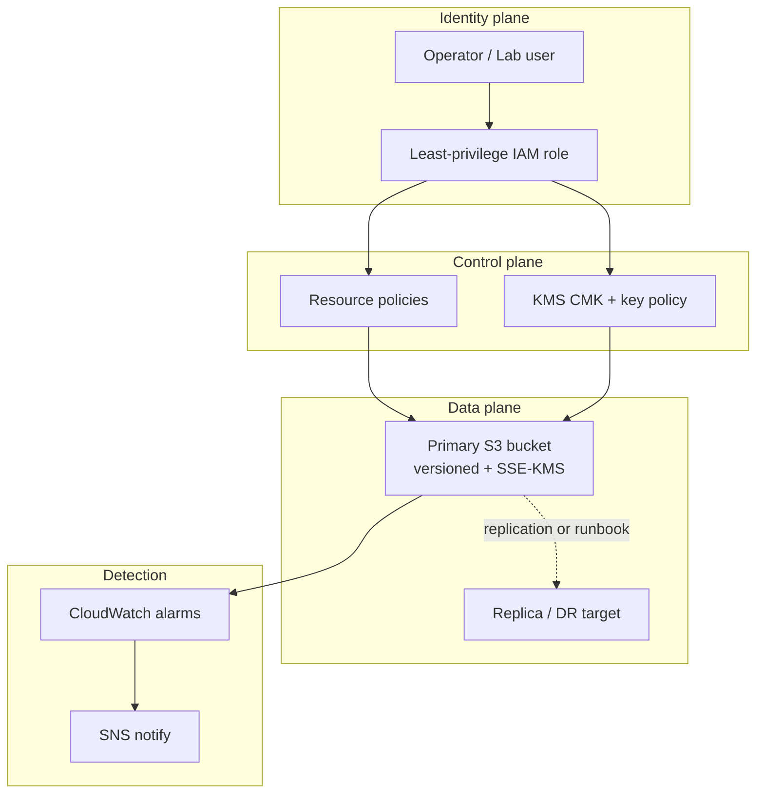

# Lesson 7.1 — Zero Trust and Trust Boundaries

**Module:** 07 — Security, Risk, Compliance, and Resilience  
**Duration:** ~20 minutes (live portion)  
**Learning objectives:** M07-LO1

---

## Opening hook (NorthStar)

NorthStar’s CISO, **Priya Raman** (fictional), tells the Lead EA: “We keep buying Zero Trust tools, but partners still land files into shared buckets with broad IAM roles. Audit asked who can read payment settlement files—and we could not answer in under an hour.” The problem is not a missing product; it is missing **trust boundaries** and **least privilege** as architecture.

> **Fiction notice:** NorthStar Financial Services and named personas are fictional instructional constructs.

---

## Learning outcomes for this lesson

By the end of this lesson, students can:

1. Explain Zero Trust as continuous verification, least privilege, and assume-breach applied to identity, app, and data planes.
2. Draw trust boundaries for a NorthStar digital-platform slice and map them to IAM and encryption controls.

---

## Key concepts

### Zero Trust (architecture meaning)

Zero Trust is a design posture: never assume a network location, account, or “internal” label equals trustworthiness. Every access is evaluated against identity, device/context (where available), least privilege, and continuous monitoring. For enterprise architects, the deliverable is **boundary clarity + control ownership**, not a vendor checklist.

### Trust boundaries

A trust boundary is where trust assumptions change—user → edge, edge → app, app → data store, partner → landing zone, admin plane → workload plane. Crossing a boundary requires authentication, authorization, encryption, and often logging.

### Least-privilege IAM

Prefer short-lived credentials, role assumption, resource-scoped policies, and deny-by-default. Broad `s3:*` on `*` is an architecture defect, not a convenience.

---

## Framework / model

**Zero Trust platform slice (NorthStar lab analogue)**

```text
[Partner / Operator Identity]
        |
   Trust Boundary A — AuthN/AuthZ
        |
[Control Plane: IAM / KMS policies]
        |
   Trust Boundary B — Encrypt & authorize
        |
[Data Plane: S3 objects + versions]
        |
   Trust Boundary C — Detect & alert
        |
[Observability: CloudWatch / SNS]
```

---

## Enterprise example (NorthStar)

Payment settlement files (classification: **Restricted**) land in an encrypted S3 bucket. A “settlement-processor” role may `GetObject`/`PutObject` only on `settlements/*`. A “auditor-read” role may `GetObject` on `evidence/*` only. KMS key policies require those roles; CloudTrail and bucket access logs support evidence. No public ACLs; Block Public Access on.

---

## Trade-offs

| Option | Pros | Cons | When it fits |
| ------ | ---- | ---- | ------------ |
| Perimeter-heavy (VPN + flat IAM) | Familiar; fast for legacy | Lateral movement risk; weak evidence | Temporary coexistence only |
| Zero Trust boundaries + least privilege | Clear ownership; audit-ready | Upfront design effort | New platforms and high-sensitivity data |
| Tool sprawl without boundaries | Looks modern | Cost without risk reduction | Avoid |

---

## Common mistakes

- Equating “private subnet” with Zero Trust while IAM remains wildcards.
- Putting all humans in one admin role “for the lab” and never modeling production analogues.
- Encrypting with AWS-managed keys while key policy and separation of duties are ignored in the narrative.

---

## Discussion prompts

1. Where does trust change when a NorthStar partner uploads a settlement file?
2. What would you refuse to approve in an ARB if IAM still uses `Resource: "*"` for S3?

---

## Diagram (Mermaid)



---

## Transition to next lesson / lab

Boundaries tell you *where* to protect. STRIDE threat modeling tells you *what can go wrong* at each boundary—and which controls matter first.

---

## References for instructors (non-proprietary)

- Course Zero Trust framing in content standards and NorthStar baseline
- Student template: risk-control matrix; lab Terraform IAM examples
