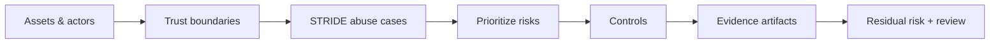

# Lesson 7.2 — Threat Modeling with STRIDE

**Module:** 07 — Security, Risk, Compliance, and Resilience  
**Duration:** ~20 minutes (live portion)  
**Learning objectives:** M07-LO2

---

## Opening hook (NorthStar)

After a near-miss where a contractor role could list settlement objects, Risk asks: “Did anyone threat-model the new landing zone?” Teams reply with a pen-test PDF from last year. Priya’s point: **threat modeling is a living architecture artifact**, scoped to the system you are changing—not a shelfware report.

> **Fiction notice:** NorthStar Financial Services is fictional.

---

## Learning outcomes for this lesson

By the end of this lesson, students can:

1. Scope a lightweight STRIDE threat model for a bounded NorthStar platform.
2. Map threats to preventive, detective, and corrective controls with residual risk notes.

---

## Key concepts

### Lightweight threat modeling

Timebox to 30–60 minutes for a change-sized system. Identify assets, actors, entry points, trust boundaries, and abuse cases. Prefer completeness of *priority risks* over exhaustive enumeration.

### STRIDE

| Letter | Meaning | Typical platform example |
| ------ | ------- | ------------------------ |
| S | Spoofing | Stolen keys / assumed wrong role |
| T | Tampering | Object overwrite without versioning |
| R | Repudiation | Missing access logs / CloudTrail gaps |
| I | Information disclosure | Over-broad GetObject / misclassified data |
| D | Denial of service | Runaway deletes; event floods |
| E | Elevation of privilege | Wildcard IAM; confused deputy |

### Controls and residual risk

Every prioritized threat needs an owner, a control, and an evidence path. Residual risk is explicit—not “mitigated” by hope.

---

## Framework / model

```text
1. Scope & assets
2. Draw trust boundaries
3. STRIDE pass per boundary
4. Prioritize (likelihood × impact for NorthStar)
5. Map controls + evidence
6. Agree residual risk + review date
```

---

## Enterprise example (NorthStar)

**System:** Digital platform settlement landing zone (lab analogue).  
**Assets:** Restricted settlement files; KMS keys; IAM roles; evidence objects.  
**Top abuse case (I):** Broad role lists all prefixes → information disclosure.  
**Control:** Prefix-scoped IAM + KMS grants + Block Public Access.  
**Evidence:** IAM policy JSON, KMS key policy, bucket public-access block settings, access-log sample.

---

## Trade-offs

| Option | Pros | Cons | When it fits |
| ------ | ---- | ---- | ------------ |
| Full formal threat model (multi-day) | Deep coverage | Slow; rarely updated | High-criticality greenfield |
| Lightweight STRIDE (this course) | Fast; actionable | May miss edge cases | Most change reviews |
| Skip modeling; rely on scan tools | Tooling comfort | Blind to design flaws | Never as sole control |

---

## Common mistakes

- Listing STRIDE rows without abuse cases or owners.
- Treating “encryption enabled” as covering Spoofing and Elevation.
- Ignoring insider and contractor pathways because the network is “private.”

---

## Discussion prompts

1. Which STRIDE category is most under-managed in file-landing architectures—and why?
2. How do you keep threat models alive across ARB and change tickets?

---

## Diagram (Mermaid)



---

## Transition to next lesson / lab

Threats include availability. Resilience design answers: how fast can we recover, and how much data can we afford to lose?

---

## References for instructors (non-proprietary)

- Student template: `student/templates/10-threat-model.md`
- Lab control-evidence matrix section
