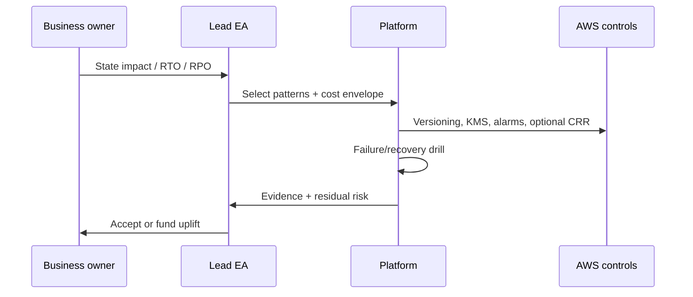

# Lesson 7.3 — Resilience, RTO/RPO, and Disaster Recovery

**Module:** 07 — Security, Risk, Compliance, and Resilience  
**Duration:** ~20 minutes (live portion)  
**Learning objectives:** M07-LO3

---

## Opening hook (NorthStar)

A region-level S3 impairment scenario in a tabletop exercise reveals that Payment Processing leadership *assumed* RTO of 15 minutes and RPO of zero—while the platform team’s actual posture was nightly copies with untested restore. The CIO asks the Lead EA to **make resilience measurable** and stop treating DR as a slide.

> **Fiction notice:** NorthStar Financial Services is fictional.

---

## Learning outcomes for this lesson

By the end of this lesson, students can:

1. Define RTO and RPO as business targets tied to workload tiers.
2. Select recovery techniques (versioning, backups, replication, runbooks) with cost and complexity trade-offs, and design a failure/recovery test.

---

## Key concepts

### RTO and RPO

- **RTO (Recovery Time Objective):** Maximum acceptable downtime after a disruption.
- **RPO (Recovery Point Objective):** Maximum acceptable data loss measured in time.

Architects translate these into patterns and tests—not slogans.

### Workload tiers (NorthStar example)

| Tier | Example | Illustrative RTO | Illustrative RPO |
| ---- | ------- | ---------------- | ---------------- |
| 0 | Payment auth path | Minutes | Near-zero |
| 1 | Settlement file landing | < 4 hours | < 15 minutes |
| 2 | Analytics extracts | < 24 hours | < 24 hours |

Lab focus is Tier-1 analogue: settlement objects with versioning + encryption + optional replication or simulated DR runbook.

### Recovery techniques (cost-aware)

| Technique | Improves | Cost / ops note |
| --------- | -------- | --------------- |
| S3 versioning + MFA delete (prod pattern) | Accidental delete/tamper recovery | Low storage growth |
| SSE-KMS | Confidentiality of recovered objects | Key policy discipline |
| Cross-Region Replication | Region impairment | Ongoing replication + storage cost |
| Documented restore runbook + drill | Organizational readiness | Cheap; high value |
| Always-on dual active | Lowest RTO | Expensive; out of lab scope |

---

## Framework / model

```text
Business impact → RTO/RPO targets → Pattern selection →
Implement controls → Instrument alarms → Failure/recovery test →
Evidence pack → Residual risk acceptance
```

---

## Enterprise example (NorthStar)

For the lab platform: set RPO ≤ 15 minutes via versioning (object versions retained) and optional CRR; set RTO ≤ 4 hours via runbook that restores from version or promotes replica prefix. CloudWatch alarms detect anomalous delete metrics or replication failures. Students execute a controlled “delete current version / restore prior version” test and record elapsed time.

---

## Trade-offs

| Option | Pros | Cons | When it fits |
| ------ | ---- | ---- | ------------ |
| Versioning only | Cheap; strong accidental-delete defense | Same-region impairment | Most lab and many prod file stores |
| Versioning + CRR | Region diversification | Cost; config complexity | Higher-tier data with budget |
| Active-active multi-region | Minimal RTO | High cost/complexity | True Tier-0 only |
| Untested backup claims | Looks fine on slides | Fails when needed | Never acceptable |

---

## Common mistakes

- Copying Tier-0 RTO/RPO onto every system.
- Enabling replication without a restore runbook or ownership.
- Skipping the recovery test because “versioning is on.”

---

## Discussion prompts

1. Who at NorthStar should *own* RTO/RPO for settlement files—business or platform?
2. When would you recommend simulated DR (runbook drill) over paying for CRR?

---

## Diagram (Mermaid)



---

## Transition to next lesson / lab

Recovery that cannot be evidenced will not satisfy compliance or executives. Next: turn controls into a **control-evidence matrix**.

---

## References for instructors (non-proprietary)

- Student template: `student/templates/11-rto-rpo-worksheet.md`
- Cost estimate: `infrastructure/cost-estimates/lab-07.md`
