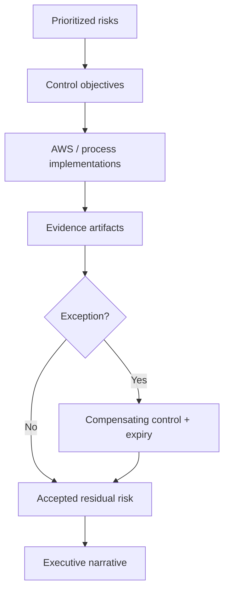

# Lesson 7.4 — Compliance Evidence and Architecture Leadership

**Module:** 07 — Security, Risk, Compliance, and Resilience  
**Duration:** ~15 minutes (live portion)  
**Learning objectives:** M07-LO4

---

## Opening hook (NorthStar)

Internal audit asks for evidence that Restricted settlement data is encrypted, access is least-privilege, and recovery objectives are tested. Engineering produces screenshots of consoles; Compliance wants a **traceable matrix**: risk → control → implementation → artifact → owner → last tested. That matrix is an architecture leadership product.

> **Fiction notice:** NorthStar Financial Services is fictional. Do not invent fake regulator filing names.

---

## Learning outcomes for this lesson

By the end of this lesson, students can:

1. Build a control-evidence matrix tied to deployed AWS controls.
2. Brief residual risk and negotiate time-bound exceptions with compensating controls.

---

## Key concepts

### Evidence vs. intention

“We encrypt” is intention. Evidence is: KMS key ARN + key policy + bucket default encryption settings + sample object metadata showing `SSE-KMS` + change ticket for last key rotation review.

### Control-evidence matrix

| Column | Purpose |
| ------ | ------- |
| Risk / threat | What we fear |
| Control objective | What “good” means |
| Control implementation | Concrete tech/process |
| Evidence artifact | Where an auditor looks |
| Owner | Accountable role |
| Test / review date | Freshness |

### Exception management

Exceptions need expiry, compensating control, approver, and residual risk statement. Permanent exceptions without review are architecture debt.

---

## Framework / model

```text
Threat model priorities
        ↓
Control objectives (prevent / detect / correct)
        ↓
Implement in platform (IAM, KMS, S3, CW)
        ↓
Capture evidence paths
        ↓
Executive residual-risk narrative
```

---

## Enterprise example (NorthStar)

| Risk | Control objective | Implementation | Evidence |
| ---- | ----------------- | -------------- | -------- |
| Disclosure of Restricted objects | Encrypt at rest with customer-managed key | SSE-KMS on bucket; key policy | Bucket encryption JSON; key policy |
| Over-broad access | Least privilege by prefix | IAM role policies | Policy documents; Access Analyzer findings (if used) |
| Untested recovery | Demonstrate restore within RTO | Version restore drill | Lab notes + timestamps + CloudWatch alarm history |

---

## Trade-offs

| Option | Pros | Cons | When it fits |
| ------ | ---- | ---- | ------------ |
| Lightweight matrix (course) | Fast; executive-usable | Not a GRC system of record | Architecture packs / ARB |
| Full GRC tooling | Scale; workflows | Cost; process overhead | Enterprise program |
| Screenshots only | Easy | Non-durable; incomplete | Insufficient alone |

---

## Common mistakes

- Listing AWS service names as controls without objectives or evidence.
- Claiming “compliant” without residual risk.
- Hiding exceptions in Slack instead of dated records.

---

## Discussion prompts

1. How do you push back when a BU asks for a permanent wildcard IAM exception?
2. What three evidence artifacts would you bring to an executive risk committee this week?

---

## Diagram (Mermaid)



---

## Transition to next lesson / lab

Lab 07 implements the platform slice and forces you to produce the matrix from real resources—then clean up to control cost.

---

## References for instructors (non-proprietary)

- Student template: `student/templates/18-risk-control-matrix.md`
- Instructor reference solution control-evidence sample
