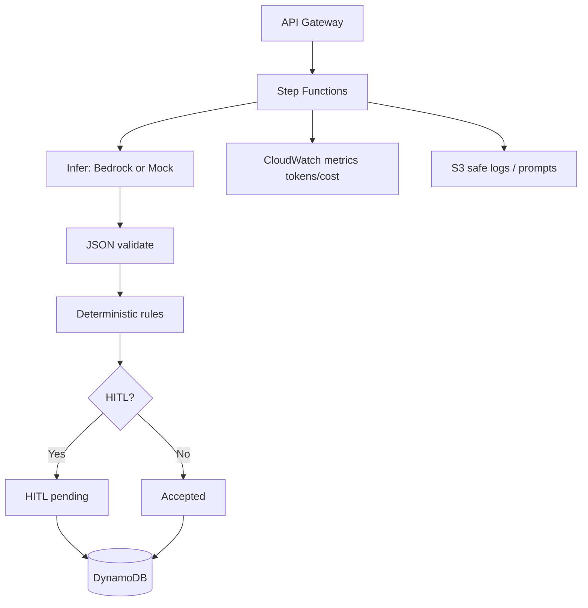

# Diagrams — Module 08

```mermaid
flowchart TB
  API[API Gateway] --> SF[Step Functions]
  SF --> INF[Infer: Bedrock or Mock]
  INF --> VAL[JSON validate]
  VAL --> RULES[Deterministic rules]
  RULES --> HITL{HITL?}
  HITL -->|Yes| QUEUE[HITL pending]
  HITL -->|No| OK[Accepted]
  QUEUE --> DDB[(DynamoDB)]
  OK --> DDB
  SF --> CW[CloudWatch metrics tokens/cost]
  SF --> S3[S3 safe logs / prompts]
```
