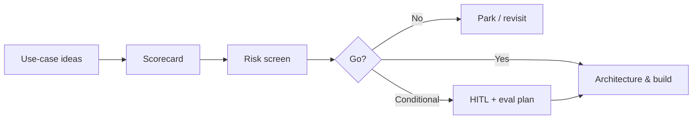

# Lesson 8.1 — Enterprise AI Strategy and Use-Case Selection

**Module:** 08 — AI Strategy and Intelligent Enterprise Architecture  
**Duration:** ~20 minutes  
**Learning objectives:** M08-LO1

---

## Opening hook (NorthStar)

NorthStar’s COO wants “AI everywhere.” Three business units propose chatbots; none can state a measurable operating KPI. Meanwhile, Incident Response drowns in noisy tickets. The Lead EA must separate **strategy** (portfolio of governed use cases) from **pilot theater**.

> **Fiction notice:** NorthStar Financial Services is fictional.

---

## Learning outcomes

1. Apply a multi-dimension scorecard to AI use cases.
2. Recommend go / conditional-go / no-go with HITL implications.

---

## Key concepts

### Strategy vs. tool chasing
Enterprise AI strategy ties use cases to outcomes, data readiness, risk appetite, and operating model—not model brand names.

### Use-case scorecard dimensions
Business value, feasibility, data readiness, risk/harm, operability, cost sensitivity, strategic alignment.

### Incident decision assistant (this module’s anchor)
Given an operational incident narrative, propose: category, severity, business impact, routing team, next actions, and whether HITL is required.

---

## Framework

```text
Intake → Score → Risk screen → Architecture pattern fit →
HITL policy → Eval plan → Go / Conditional / No-go
```

---

## Enterprise example

Incident Response use case scores high on value and alignment, medium on data readiness (needs sanitized historical tickets), elevated risk (wrong routing can delay payments). Conditional-go with HITL for severity ≥ High.

---

## Trade-offs

| Option | Pros | Cons | When it fits |
| ------ | ---- | ---- | ------------ |
| Many shallow chatbots | Visible activity | Weak outcomes; risk sprawl | Avoid as strategy |
| Few governed assistants | Measurable; auditable | Slower start | Enterprise default |
| Fully autonomous actions | Speed | High blast radius | Rare; strong controls only |

---

## Common mistakes
- Scoring only “coolness”
- Ignoring operability (who owns prompts, eval, drift?)
- Skipping risk because “it’s only a suggestion”

---

## Discussion prompts
1. What would make the incident assistant a no-go at NorthStar?
2. Which scorecard dimension is most often faked in executive decks?

---

## Diagram



---

## Transition
Selection without architecture creates shadow AI. Next: governed patterns with structured outputs.
