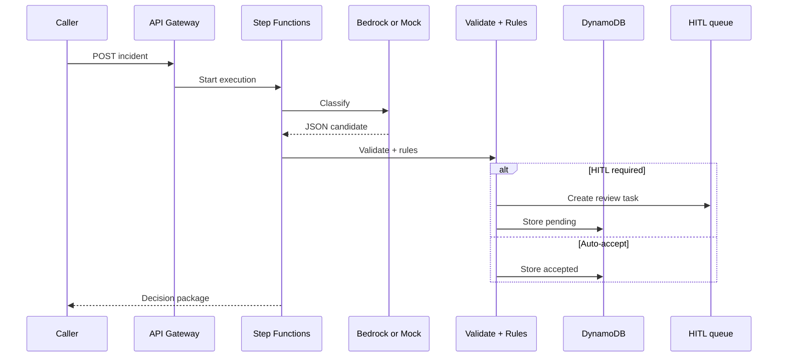

# Lesson 8.2 — Governed AI Architecture Patterns

**Module:** 08  
**Duration:** ~20 minutes  
**Learning objectives:** M08-LO2

---

## Opening hook

A NorthStar squad embeds a raw model call in a Lambda and posts free-text “recommendations” into Slack. There is no schema, no validation, no audit trail, and no cost meter. The EA’s intervention: **structured outputs + orchestration + policy gates**.

---

## Learning outcomes

1. Describe a reference architecture for an operational decision assistant.
2. Specify JSON output contracts and validation responsibilities.

---

## Key concepts

### Reference flow
API Gateway → Lambda/Step Functions → (Bedrock or mock) → schema validation → deterministic rules → DynamoDB persistence → optional HITL task → response.

### Structured prompt + JSON schema
Ask the model for constrained fields only. Validate before side effects. Reject or HITL on schema failure.

### Deterministic rules vs. probabilistic inference
Model proposes; rules enforce invariants (e.g., severity Critical always HITL; payments outage always routes to Payments-SRE).

### Mock/fallback mode
When Bedrock model access is unavailable, a deterministic mock classifier teaches the same architecture and evaluation loop.

---

## Framework

```text
Input incident
  → Retrieve context (optional)
  → Model inference (or mock)
  → JSON schema validate
  → Business rules
  → Persist + meter tokens/cost
  → HITL if required
  → Return decision package
```

---

## Trade-offs

| Option | Pros | Cons | When |
| ------ | ---- | ---- | ---- |
| Free-text LLM replies | Flexible | Hard to govern/eval | Not for ops routing |
| Structured JSON + validate | Auditable | Upfront schema work | Operational decisions |
| Fully synchronous Bedrock only | Simple | Fails if model access blocked | Add mock fallback |

---

## Common mistakes
- Logging raw prompts with PII
- Letting the model choose irreversible actions without rules
- No token/cost metrics

---

## Discussion prompts
1. Which fields must never be solely model-authored without rules?
2. What belongs in Step Functions vs. a single Lambda?

---

## Diagram



---

## Transition
Architecture without operating model fails at 2 a.m. Next: HITL, evaluation, and ownership.
