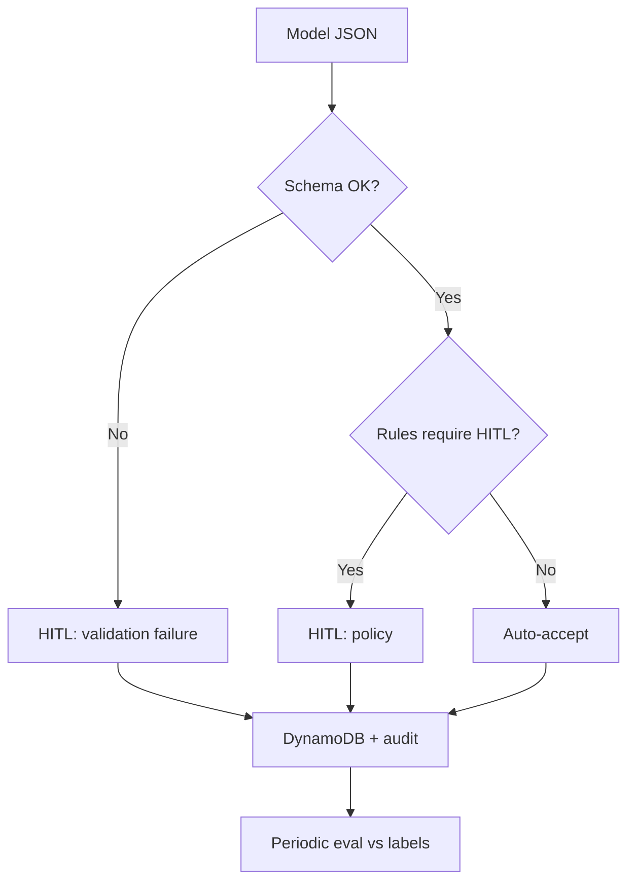

# Lesson 8.3 — HITL, Evaluation, and Operating Model

**Module:** 08  
**Duration:** ~20 minutes  
**Learning objectives:** M08-LO3, M08-LO4

---

## Opening hook

A High-severity mis-route delays partner settlement reconciliation by four hours. Post-incident review finds the assistant auto-applied a model suggestion with low confidence and no human review. NorthStar institutes **HITL triggers** and an **evaluation cadence**.

---

## Learning outcomes

1. Define HITL triggers and reviewer roles.
2. Construct a minimal evaluation dataset and quality measure.

---

## Key concepts

### HITL triggers (examples)
- Severity High or Critical
- Confidence below threshold
- Category in regulated/sensitive set
- Schema validation warnings
- Business impact includes customer-funds language

### Evaluation dataset
Labeled historical (synthetic) incidents with expected category/severity/routing/HITL. Score model or mock outputs against labels.

### Quality measure
Example: **Exact-match routing accuracy** + **severity within one level** + **HITL-flag recall for High/Critical**. Composite pass threshold agreed with Incident Response.

### Safe logging
Store incident IDs, hashes, redacted summaries, model IDs, token counts—not raw PAN/PII. Retention limits on S3/DynamoDB lab data.

---

## Trade-offs

| Option | Pros | Cons | When |
| ------ | ---- | ---- | ---- |
| HITL on everything | Safe | No speed benefit | Early pilots |
| HITL on triggers | Balanced | Trigger design effort | Default |
| No HITL | Fast | Unacceptable blast radius | Not for High/Critical |

---

## Common mistakes
- HITL theater (nobody staffed to review)
- Eval set of 3 happy paths only
- Optimizing fluency instead of routing correctness

---

## Discussion prompts
1. Who is on-call to clear HITL queues during a major incident?
2. What quality measure would you refuse to game?

---

## Diagram

---

## Transition
Leaders must fund eval and HITL staffing—or reject the use case. Next: cost, risk communication, and lab.
