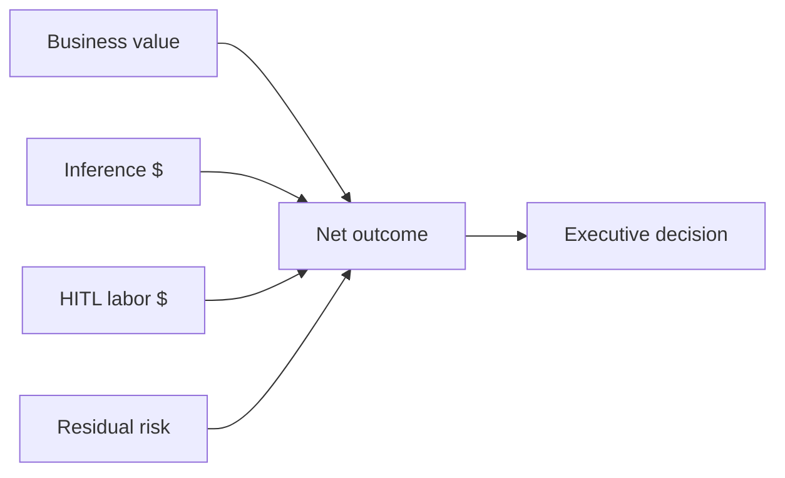

# Lesson 8.4 — Cost, Risk, and Architecture Leadership for AI

**Module:** 08  
**Duration:** ~15 minutes  
**Learning objectives:** M08-LO4

---

## Opening hook

Finance sees a Bedrock bill spike from a weekend load test with verbose prompts. The EA adds **token/cost tracking**, prompt budgets, and an executive narrative: AI value is net of inference cost, review labor, and residual error risk.

---

## Learning outcomes

1. Treat tokens/cost as first-class architecture telemetry.
2. Brief executives on residual AI risk and operating costs honestly.

---

## Key concepts

### Cost drivers
Tokens in/out, model class, retries, logging storage, HITL labor (often dominant).

### Risk communication
Separate model error risk, integration risk, and process risk. Avoid “the model decided.”

### ADR topics
Mock vs live Bedrock; model selection; HITL policy; retention of prompts.

---

## Trade-offs

| Option | Pros | Cons | When |
| ------ | ---- | ---- | ---- |
| Cheapest small model | Low $ | Higher error rate | High HITL coverage |
| Larger model | Better quality | Cost | Narrow high-value paths |
| Mock in lab | Reliable teaching | Not production inference | Classrooms / blocked access |

---

## Common mistakes
- Ignoring HITL labor in TCO
- No kill switch / feature flag for the assistant
- Declaring victory on demo day without eval

---

## Discussion prompts
1. What cost metric belongs on an AI product’s weekly ops review?
2. How do you stop shadow AI when central governance feels slow?

---

## Diagram

---

## Transition
Lab 08 implements the assistant with Bedrock or mock fallback—measure, validate, evaluate, clean up.
