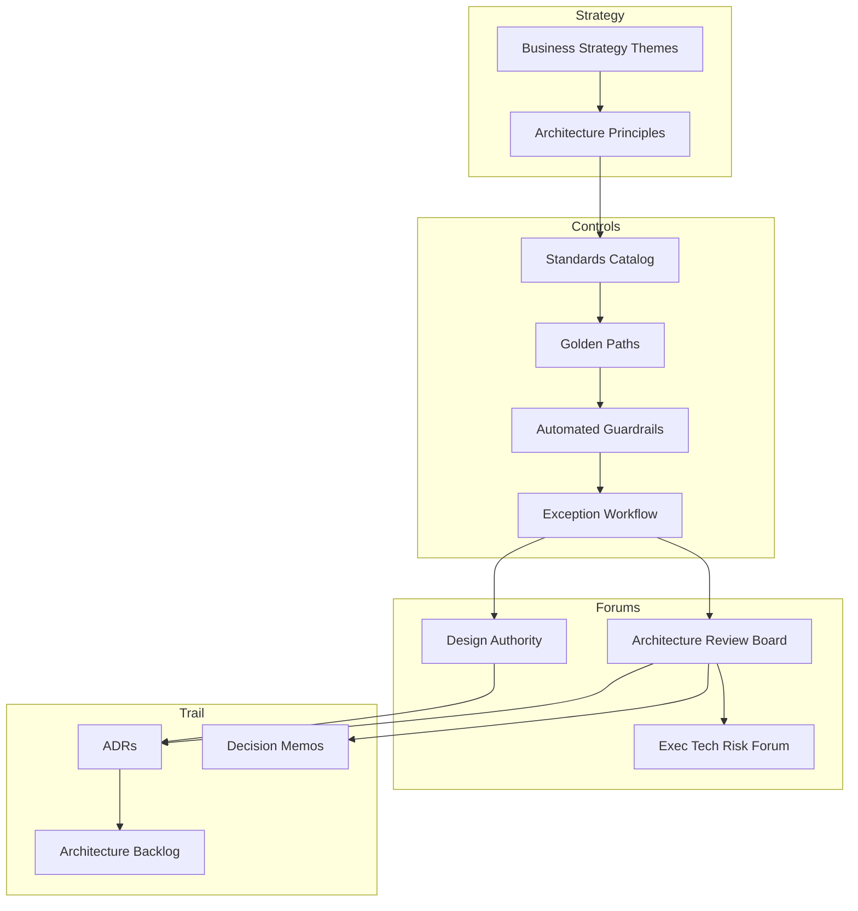

# Diagram — Governance Operating Model

**Module:** 09  
**Audience:** Students and instructors

```mermaid
flowchart TB
  subgraph Strategy
    PR[Architecture Principles]
    ST[Business Strategy Themes]
  end
  subgraph Controls
    CAT[Standards Catalog]
    GP[Golden Paths]
    GR[Automated Guardrails]
    EX[Exception Workflow]
  end
  subgraph Forums
    DA[Design Authority]
    ARB[Architecture Review Board]
    EXCO[Exec Tech Risk Forum]
  end
  subgraph Trail
    ADR[ADRs]
    MEMO[Decision Memos]
    BL[Architecture Backlog]
  end
  ST --> PR
  PR --> CAT
  CAT --> GP
  GP --> GR
  GR --> EX
  EX --> DA
  EX --> ARB
  ARB --> EXCO
  DA --> ADR
  ARB --> ADR
  ARB --> MEMO
  ADR --> BL
```
