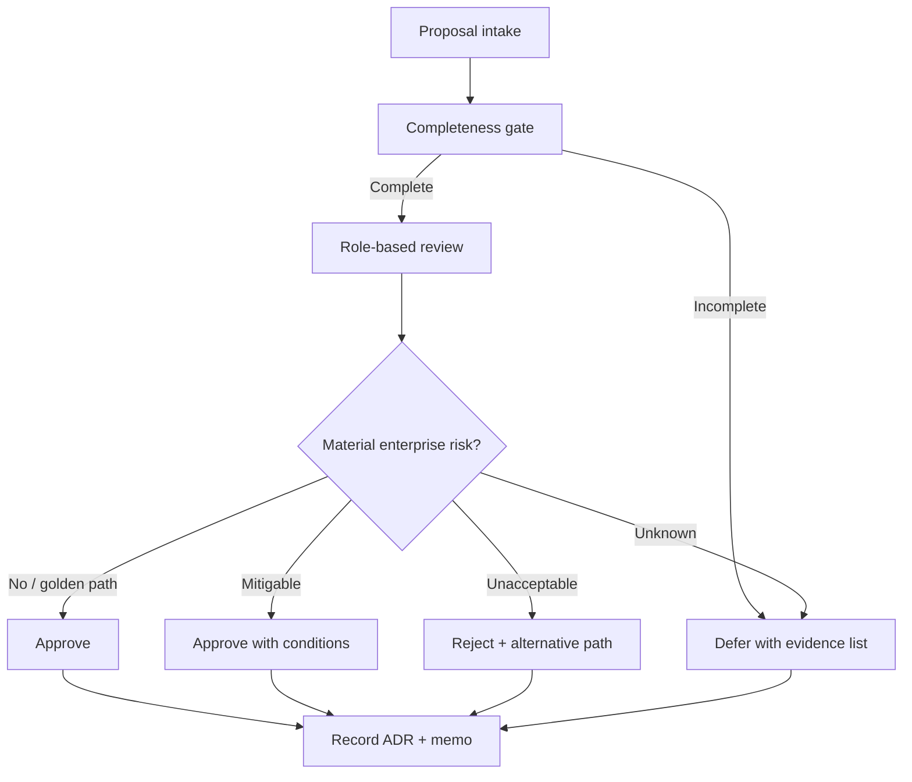

# Diagram — ARB Decision Flow

```mermaid
flowchart TD
  IN[Proposal intake] --> PRE[Completeness gate]
  PRE -->|Incomplete| DEF[Defer with evidence list]
  PRE -->|Complete| REV[Role-based review]
  REV --> OPT{Material enterprise risk?}
  OPT -->|No / golden path| APP[Approve]
  OPT -->|Mitigable| COND[Approve with conditions]
  OPT -->|Unacceptable| REJ[Reject + alternative path]
  OPT -->|Unknown| DEF
  APP --> REC[Record ADR + memo]
  COND --> REC
  REJ --> REC
  DEF --> REC
```
