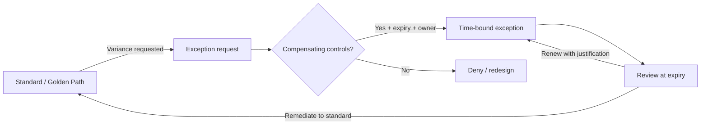

# Diagram — Standards vs Exceptions

```mermaid
flowchart LR
  S[Standard / Golden Path] -->|Variance requested| E[Exception request]
  E --> C{Compensating controls?}
  C -->|Yes + expiry + owner| T[Time-bound exception]
  C -->|No| N[Deny / redesign]
  T --> R[Review at expiry]
  R -->|Renew with justification| T
  R -->|Remediate to standard| S
```
