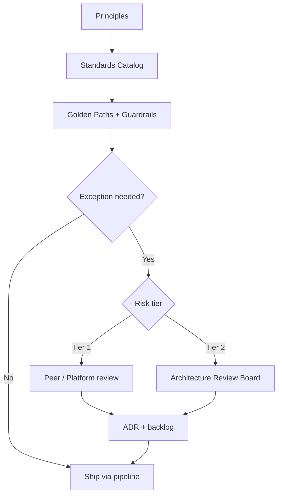

# Lesson 9.1 — Architecture Governance Models

**Module:** 09 — Architecture Governance and Executive Communication  
**Duration:** ~20 minutes (live portion)  
**Learning objectives:** M9-LO1

---

## Opening hook (NorthStar)

NorthStar’s Retail Payments BU just funded a “fast path” modernization. Their architect chose a second public cloud, a proprietary database, a custom integration framework, and asked for break-glass production access for contractors. Delivery starts Monday. The CIO asks you—Lead EA—whether governance is “blocking innovation” or preventing the next multi-year tax. You have forty-eight hours before the Architecture Review Board.

---

## Learning outcomes for this lesson

By the end of this lesson, students can:

1. Describe the components of an enterprise architecture governance operating model.
2. Select a governance intensity (guardrail-heavy vs. review-heavy) based on risk and change type.

---

## Key concepts

### Governance is a product, not a police force

Effective architecture governance creates **predictable paths to production**: standards catalogs, golden paths, automated policy checks, exception workflows, and selective human review. Teams that experience governance only as late “no” meetings will route around it.

### Four interlocking controls

1. **Principles** — durable intent (e.g., prefer shared platforms; least privilege; reversible decisions).
2. **Standards** — specific, versioned expectations (API style, identity pattern, logging, tagging).
3. **Guardrails** — automated enforcement where possible (IAM policy, budget alerts, pipeline checks).
4. **Forums** — human judgment for exceptions, material risk, and cross-domain trade-offs (ARB, design authority).

### Lightweight vs. heavyweight governance

| Mode | When it fits | Failure mode if misapplied |
| ---- | ------------ | -------------------------- |
| Guardrail-first | Low-risk changes on golden paths | Rubber-stamp of high-risk exceptions |
| Risk-tiered review | Material architecture change, new platform, regulated data | Everything becomes a board item; velocity dies |
| Federated design authority | Large org with mature domain architects | Inconsistent enterprise decisions |
| Centralized ARB for all changes | Early maturity or high regulatory pressure | Shadow IT and political “approvals” |

---

## Framework / model

NorthStar Governance Stack

```text
Strategy & Principles
        ↓
Standards Catalog (versioned)
        ↓
Golden Paths + Automated Guardrails
        ↓
Exception Workflow (time-bound)
        ↓
Architecture Review Board (material risk)
        ↓
Decision Trail (ADR + memo + backlog)
```

---

## Enterprise example (NorthStar)

NorthStar’s draft policy (fictional):

- **Tier 0 (self-service):** Use approved landing zone, standard services, no new data stores → pipeline gates only.
- **Tier 1 (design review):** New domain service, new integration pattern within approved set → peer + platform review.
- **Tier 2 (ARB):** New cloud provider, proprietary data platform, custom framework, elevated prod access, regulated data model change → full ARB.

The Retail Payments proposal is Tier 2 on four independent criteria.

---

## Trade-offs

| Option | Pros | Cons | When it fits |
| ------ | ---- | ---- | ------------ |
| Central ARB for most changes | Consistency; executive visibility | Slow; encourages workarounds | Early governance maturity |
| Guardrail-first + rare ARB | Speed; scales | Requires investment in platforms/policy-as-code | Platform-ready enterprises |
| Federated domain boards only | Local ownership | Enterprise fragmentation | After strong shared platforms exist |

---

## Common mistakes

- Equating governance with slide decks and no enforcement
- Making every decision an ARB item
- Allowing permanent exceptions without owners, expiry, or compensating controls

---

## Discussion prompts

1. Where would you place NorthStar today on the lightweight↔heavyweight spectrum—and what evidence would move you?
2. Which of the four Retail Payments requests is most dangerous if approved “just this once”?

---

## Diagram (Mermaid)



---

## Transition to next lesson / lab

Next we put the board in the room: roles, agenda, disposition language, and how to challenge without theater.

---

## References for instructors (non-proprietary)

- Architecture governance as enabling constraint (platform engineering literature)
- Course content standards and NorthStar baseline
