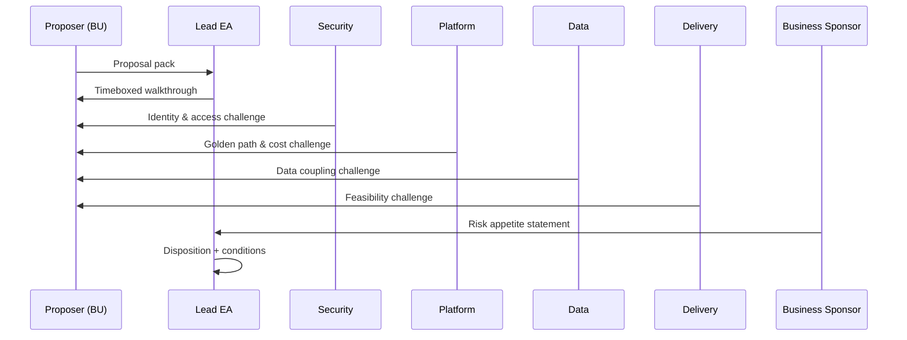

# Lesson 9.2 — Architecture Review Boards in Practice

**Module:** 09 — Architecture Governance and Executive Communication  
**Duration:** ~25 minutes (live portion)  
**Learning objectives:** M9-LO2

---

## Opening hook (NorthStar)

You walk into the ARB with six nameplates: Lead EA, Security architect, Business sponsor, Platform lead, Data architect, Delivery architect. The Retail Payments proposal is already circulating on Slack with supportive comments from a BU president. Your job is not to win an argument—it is to produce a **defensible disposition** the CIO can live with on Monday.

---

## Learning outcomes for this lesson

By the end of this lesson, students can:

1. Run an ARB agenda that surfaces risk, alternatives, and conditions—not slide critique.
2. Play distinct reviewer roles without collapsing into generic “architect opinions.”

---

## Key concepts

### Purpose of the ARB

The ARB exists to make **enterprise-scoped decisions** when local optimization creates enterprise risk: new platforms, irreversible data choices, elevated access, regulatory exposure, or material cost/ops tax.

### Role fidelity

| Role | Primary questions |
| ---- | ----------------- |
| Lead EA | Strategy alignment; principle fit; enterprise precedent |
| Security architect | Identity, least privilege, data protection, auditability |
| Business sponsor | Outcome urgency, funding, acceptable residual risk |
| Platform lead | Golden-path fit, operability, FinOps, supportability |
| Data architect | Master data, coupling, residency, analytics readiness |
| Delivery architect | Feasibility, sequencing, team skills, time-to-value |

### Disposition language (use consistently)

- **Approve** — proceeds as proposed; capture ADR
- **Approve with conditions** — proceeds only if named conditions and owners exist
- **Defer** — insufficient information; request specific evidence by date
- **Reject** — do not proceed; provide alternative path or appeal criteria

Avoid vague “concerns noted.” Conditions must be testable.

---

## Framework / model

ARB 45-minute agenda (simulation default)

```text
0–5   Framing & conflict-of-interest check
5–15  Proposer walkthrough (timeboxed)
15–30 Role-based challenge (round-robin, 2 min each)
30–40 Options & conditions synthesis
40–45 Disposition + ADR owners + follow-ups
```

---

## Enterprise example (NorthStar)

**Proposal summary (see lab proposal pack):** second cloud, proprietary DB, custom integration framework, contractor direct prod access.

**Healthy challenge examples:**

- Security: “What is the break-glass model, session recording, and expiry for contractor access?”
- Platform: “What shared services cannot be reused, and what is the five-year ops cost delta?”
- Data: “How does a proprietary store affect the customer golden record program?”
- Delivery: “What is the plan if the custom framework’s authors leave in nine months?”

---

## Trade-offs

| Option | Pros | Cons | When it fits |
| ------ | ---- | ---- | ------------ |
| Live ARB simulation | Builds judgment and soft skills | Time; uneven participation | Cohort Week 9 |
| Async written review only | Scalable | Weakens facilitation practice | Large corporate cohorts |
| Hybrid (async prep + live disposition) | Best of both | Requires discipline | Recommended default |

---

## Common mistakes

- Debating fonts and diagram aesthetics instead of risk and alternatives
- Security speaking last and vetoing everything without options
- Business sponsor treating ARB as a rubber stamp for funded work

---

## Discussion prompts

1. How do you handle a BU president who says “We’ve already bought the licenses”?
2. When is “Approve with conditions” worse than “Reject”?

---

## Diagram (Mermaid)



---

## Transition to next lesson / lab

Decisions die without records. Next: ADR craft that survives reorgs and audits.

---

## References for instructors (non-proprietary)

- Decision quality frameworks (alternatives, information, values, commitment)
- Course instructor standards for facilitation
