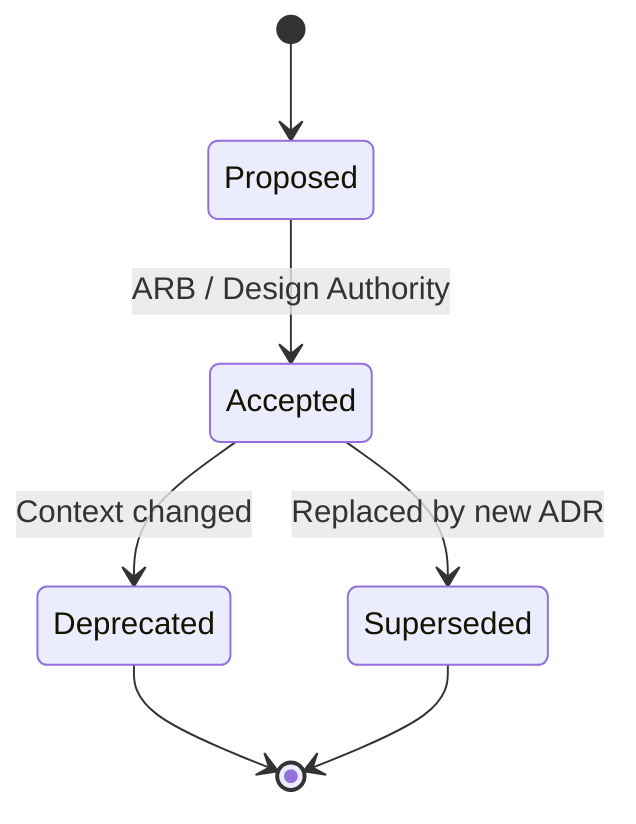

# Lesson 9.3 — Architecture Decision Records

**Module:** 09 — Architecture Governance and Executive Communication  
**Duration:** ~20 minutes (live portion)  
**Learning objectives:** M9-LO3

---

## Opening hook (NorthStar)

Eighteen months from now, a new Lead EA finds three Slack threads and a deck titled “Final_v7_REAL.” Nobody remembers why Retail Payments was allowed a second cloud. ADRs exist so NorthStar does not pay the **re-debate tax** every quarter.

---

## Learning outcomes for this lesson

By the end of this lesson, students can:

1. Structure an ADR with context, decision drivers, options, consequences, and status.
2. Distinguish decisions that deserve ADRs from routine implementation choices.

---

## Key concepts

### What belongs in an ADR

Record decisions that are **costly to reverse**, set precedent, or constrain many teams: platform choices, integration patterns, identity models, data ownership, AI control patterns, exception approvals.

### ADR anatomy (BayLearn template)

1. **Title & status** — Proposed / Accepted / Deprecated / Superseded
2. **Context** — forces, constraints, stakeholders
3. **Decision drivers** — ranked criteria (cost, risk, speed, operability, compliance)
4. **Options considered** — at least two real alternatives
5. **Decision** — what was chosen
6. **Consequences** — positive, negative, follow-ups
7. **Compliance / exceptions** — if any temporary variance

### Quality bar

An ADR is good when a skilled outsider can reconstruct *why* without interviewing the author. “Industry best practice” is not a rationale.

---

## Framework / model

```text
Context → Drivers → Options → Decision → Consequences → Follow-ups
                              ↑
                     Explicit non-choices
```

---

## Enterprise example (NorthStar)

**Candidate ADRs from the Retail Payments ARB:**

- ADR-NS-041: Reject second public cloud for BU workloads; use enterprise landing zone with exception path for sovereign workloads only.
- ADR-NS-042: Reject proprietary OLTP for customer profile; require approved managed relational/NoSQL services with encryption and backup standards.
- ADR-NS-043: Time-box contractor production access via PAM with session recording; no standing credentials.

Each ADR should reference principles (shared platforms, least privilege) and name compensating controls if any exception is granted.

---

## Trade-offs

| Option | Pros | Cons | When it fits |
| ------ | ---- | ---- | ------------ |
| Short ADR (1 page) | High adoption | May omit consequences | Most team decisions |
| Long design doc + ADR summary | Deep analysis | Low readership | Major platform bets |
| Ticket comments only | Fast | Invisible enterprise trail | Avoid for Tier 2 |

---

## Common mistakes

- Writing the decision first and reverse-engineering fake options
- Omitting negative consequences of the chosen path
- Never superseding stale ADRs when context changes

---

## Discussion prompts

1. Should an “Approve with conditions” ARB outcome produce one ADR or several?
2. Who owns ADR hygiene after the original author leaves?

---

## Diagram (Mermaid)



---

## Transition to next lesson / lab

Executives will not read five ADRs before a funding call. Next: the one-page decision memo that carries the ask.

---

## References for instructors (non-proprietary)

- Architecture Decision Records practice (public ADR community patterns)
- Course ADR template `student/templates/01-architecture-decision-record.md`
