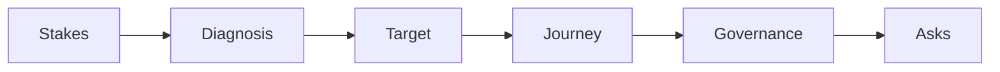

# Lesson 10.1 — Capstone Narrative Construction

**Module:** 10 — Capstone and Architecture Leadership  
**Duration:** ~20 minutes  
**Learning objectives:** M10-LO1

---

## Opening hook (NorthStar)

You have eight weeks of artifacts. The executive committee does not want eight weeks of artifacts. They want a **story**: what is broken, what “good” looks like, what we will do in 24 months, what it costs/risks, and what decisions you need today.

---

## Learning outcomes

1. Structure a problem → current → target → roadmap → ask narrative.  
2. Select only the evidence that advances executive decisions.

---

## Key concepts

### Narrative arc

1. Business outcomes and stakes  
2. Current-state diagnosis (selective)  
3. Target-state architecture  
4. Transition and 24-month roadmap  
5. Governance and risk controls  
6. Decision asks and funding logic  

### Artifact → story mapping

Not every artifact gets a slide. Many live in the appendix/document pack. Slides carry the spine; documents carry the proof.

### Decision density

Every section should either set up a decision or discharge one. If a diagram does neither, cut it from the live deck.

---

## Framework

```text
Stakes → Diagnosis → Destination → Journey → Guardrails → Asks
```

---

## Enterprise example (NorthStar)

**Weak narrative:** “Here is our capability map, then TIME model, then cloud strategy…”  
**Strong narrative:** “We will cut onboarding cycle time and dual-platform run cost by consolidating integration and landing zones in three waves—today we need approval for Wave 1 funding and the governance model.”

---

## Trade-offs

| Option | Pros | Cons | When it fits |
| ------ | ---- | ---- | ------------ |
| Chronological module replay | Easy to assemble | Low executive energy | Avoid |
| Outcome-led narrative | Decision clarity | Requires ruthless editing | Capstone default |
| Risk-led narrative | Resonates with audit committee | May underplay growth | Regulated moments |

---

## Common mistakes

- Showing all 24 artifacts in the deck  
- No explicit asks  
- Target state without transition realism  

---

## Discussion prompts

1. Which three artifacts are load-bearing for your story?  
2. Which artifacts belong only in the document pack?

---

## Diagram



---

## Transition

Next: how to survive the 10-minute Q&A without surrendering your recommendation.
