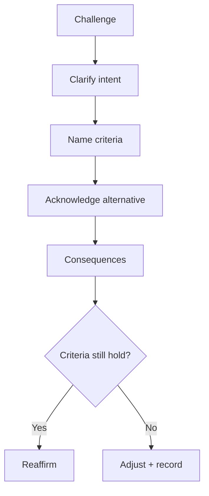

# Lesson 10.2 — Defending Architecture Trade-offs

**Module:** 10  
**Duration:** ~25 minutes  
**Learning objectives:** M10-LO2

---

## Opening hook (NorthStar)

A panelist asks: “Why not just lift-and-shift everything to the cloud in twelve months?” If your answer is “because best practice,” you have already lost. Trade-off defense requires **criteria, alternatives, and consequences**.

---

## Learning outcomes

1. Answer challenge questions using a repeatable defense pattern.  
2. Distinguish productive challenge from distraction and redirect.

---

## Key concepts

### Defense pattern (SAY)

1. **S**tate the criterion you optimized for  
2. **A**cknowledge the alternative the challenger prefers  
3. **Y**ield the consequences and residual risk of your choice  

### Challenge classes

| Class | Example | Healthy response |
| ----- | ------- | ---------------- |
| Cost | “Too expensive” | Show phased value and stoppable spend |
| Speed | “Too slow” | Offer scope phasing, not principle abandonment |
| Autonomy | “BUs need freedom” | Guardrail-first + exception path |
| Risk | “What about X?” | Name control owner and evidence |
| Precedent | “Payments got an exception” | Reference ARB trail |

### Do not

- Attack the questioner  
- Invent fake precision  
- Abandon the recommendation without criteria change  

---

## Framework

```text
Question → Clarify → Criteria → Alternative → Consequences → Reaffirm / Adjust
```

---

## Enterprise example

**Challenge:** “Why reject VectorForge if it’s faster?”  
**Defense:** “We optimized for exit cost, CMEK, and golden-record alignment. VectorForge wins synthetic throughput. On approved managed services we can meet projected load with headroom; if a PoC proves otherwise non-prod, we reopen ADR-042.”

---

## Trade-offs

| Option | Pros | Cons | When |
| ------ | ---- | ---- | ---- |
| Hold recommendation | Clarity | May look rigid | Criteria unchanged |
| Adjust under new facts | Intellectual honesty | Needs visible criteria | New evidence appears |
| Defer live | Safety | Weak leadership signal | Only if truly blocked |

---

## Common mistakes

- Over-answering (lecture)  
- Agreeing to mutually exclusive asks  
- Treating Q&A as trivia about tools  

---

## Discussion prompts

1. What is your hardest anticipated challenge? Practice SAY aloud.  
2. When would you change your recommendation live?

---

## Diagram


